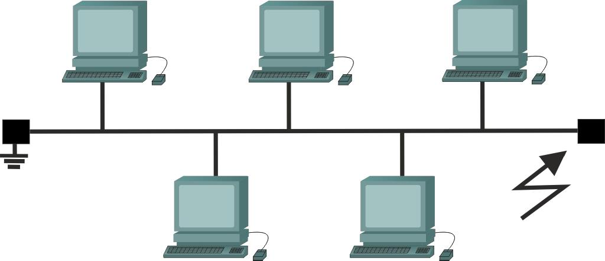
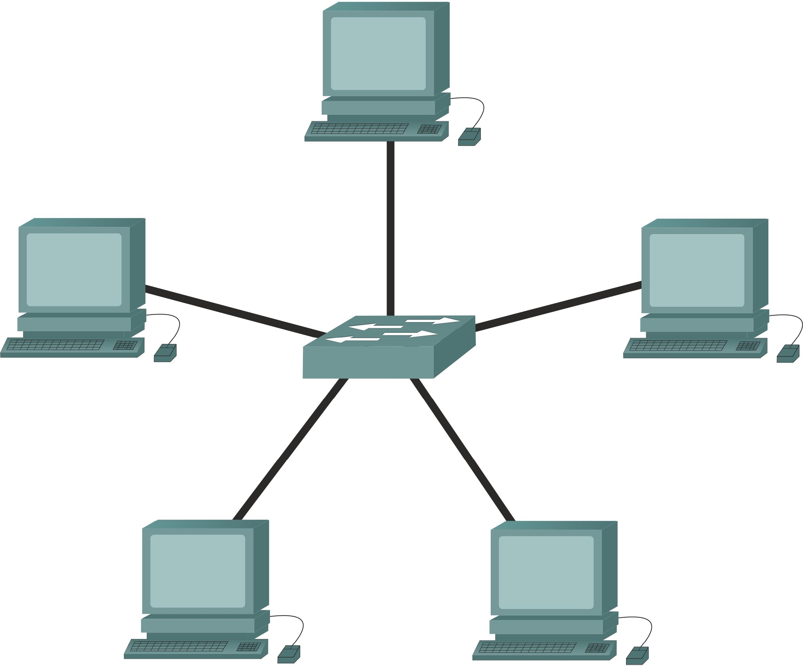
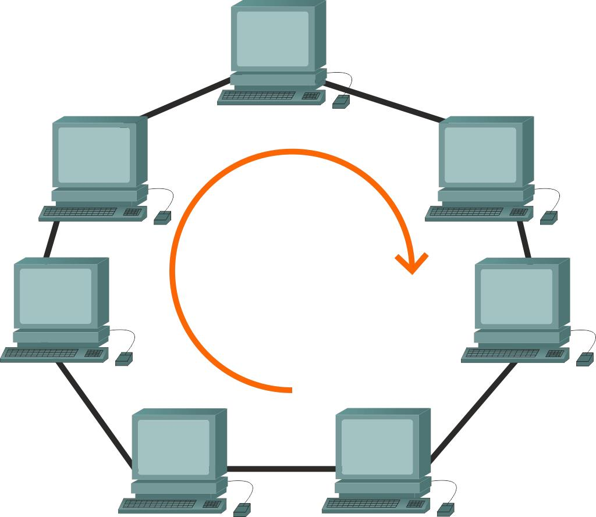
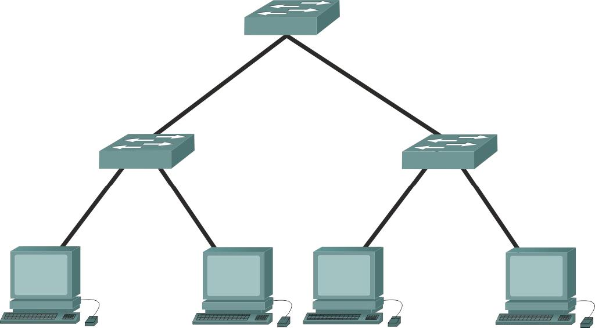
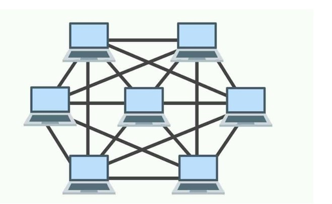

# Otázka č. 2 - Klasifikace sítí

> Rozdělení sítí podle komunikace, signálu, uzlu, rozlehlosti, vlastnictví, aktivní/pasivní prvky topologie, NOS  

>1) rozdělení sítí podle komunikace, signálu, uzlu, rozlehlosti, vlastnictví
>2) aktivní a pasivní prvky - v čem je rozdíl? příklady + stručný popis
>3) topologie - co to je? příklady + stručný popis (porovnání)
>4) NOS

## Dělení sítí

Počítačové sítě lze rozdělit mnoha způsoby, záleží na základě, jakého kritéria je rozdělit chceme. 
### 1. Rozdělení podle komunikace 

Základní kritérium je, zda pro provedení komunikace je potřeba navázat spojení.
 - spojové
   - před zahájením komunikace je potřeba navázat spojení 
   - dnes již nepoužívané nebo používané ale pouze logicky (tcp/udp)
   - příkladem jsou telefonní sítě a jejich ústředny 
   - lze navázat trvalé (PVC) nebo dočasné spojení (SVC)
   
 - nespojové
   - dnešní sítě, kdy jsou informace vyslány do sítě a tam následně filtrovány a směrovány
   - založena především na brodcastu
   
### 2. Rozdělení podle signálu

Zde se sítě dělí podle toho, jakým způsobem je signál přenášen.

   - Analogové 
     - Systém pracuje s analogovým signálem
     - Akustické, elektrické nebo optické signály.
     
   - Digitální
     - Systém pracuje s konečným množstvím hodnot  
     - Spotřebovává více energie
     
### 3. Rozdělení podle propojení
Zde jsou sítě děleny na základě média, po kterém se data přenášejí.
   - Metalické
     - nejběžnější řešení
     - nejlevnější 
     - propojení pomocí kroucené dvojlinky
       - kroucená je podle do sebe zakroucených párů vodičů (4 páry) => tím se vyruší elektromagnetické rušení
       - nižší šířka pásma (tím pádem i menší datový přenos)
       - hodně omezena vzdálenost (cca 100m – záleží na kabelu)
       - přenosová rychlost max 10 Gb/s
     - nebo koaxiálního kabelu
       - dnes téměř nevyužívané, jen v některých budovách (např. panelové domy)

   - Optické
     - propojení pomocí optických kabelů
       - dražší 
       - lepší dosah na větší vzdálenosti v řádech km
       - vysoká přenosová kapacita
       - odolnost proti rušení 
       - laser nebo diodové
       
   - Bezdrátové 
     - jako médium je používán vzduch
     
### 4. Rozdělení podle uzlů 
Síť se dá také rozdělit podle toho, jak jsou si navzájem postaveny jednotlivé uzly.

   - Peer-to-peer
     - V této síti jsou všechny konečné uzly sobě rovny 
     - Každá stanice nabízí službu ostatním stanicím. 
     - Jednoduchost sítě

   - Klient-server 
     - Služby nabízí specializované zařízení 
     - Jednotlivým klientům jsou pak přidělována práva 
     - Servery mají specializovaný operační systém

### 5. Rozdělní podle rozlehlosti 
- PAN
   - Síť pro potřeby jednotlivého člověka (Bluetooth) 
- LAN
   - Lokální síť, pod správou jednou administrací
   - Vytvořena pro jednu firmu, domácnost, lokalitu nebo účel.
   - Bezdrátová = WLAN
- MAN 
  - Síť pro potřeby města, např chytré řízení dopravy a pro potřeby města 
  - Nebo například propojení více lan v rámci města
- WAN 
  - Rozsáhlá síť o Spravovaná operátorem ISP o Propojuje MAN a LAN
- SAN
   - Síť pro potřeby spojení úložišť nebo připojení zálohovacího serveru
   k serveru jinému
  
### 6. Rozdělní podle vlastnictví 
- Veřejné (PDN)
  - Vlastníkem sítě je společnost nabízející síť veřejnosti 
  - Slouží k propojení lokálních sítí 
  - Adresa je přidělována poskytovatelem (veřejná adresa)

- Privátní o Vznikli především kvůli nedostatku ipv4 adres
  - Využívá se pro domácí, podnikové nebo lokální použití (LAN)

- Virtuální privátní síť (VPN) 
  - Umožňuje propojení několika počítačů pomocí veřejné sítě
  - Vznikne tak stav, kdy mezi sebou zařízení komunikují jako by byly fyzicky připojeny do jedné sítě
  - Při navazování spojení se zařízení identifikují pomocí certifikátů
  - Komunikace je šifrovaná
  
## Aktivní a pasivní prvky

   Rozdíl mezi aktivními a pasivním prvky je ten, že aktivní prvky signál zpracovávají, modifikují nebo přeposílají, z pravidla je potřeba je napájet. Pasivní prvky naopak signál pouze přenášejí. 
### Mezi aktivní prvky patří např.:    
- Hub 
  - Duplikuje signál do všech portů (kopíruje přijaté bity) 
  - Funguje na fyzické neboli první vrstvě ISO/OSI modelu
  
- Switch 
  - Obsahuje mac tabulku na základě, které se rozhoduje, na který port přijatý signál pošle
  - Pracuje tedy na druhé vrstvě (linkové) ISO/OSI modelu
- Router 
  - Zajišťuje směrování zpráv do dalších sítí na základě ip adres
  - Pracuje tedy na třetí (síťové) vrstvě
- Repeater
  - Přijímá poškozený nebo slabý signál, který opravuje, zesiluje a posílá dále.
- …

###     Mezi pasivní prvky patří především kabely. 
[popsané výše] 

## Topologie používané v datových sítích

Základní dělení topologií je na fyzické a logické.

> Fyzická topologie se zabývá fyzickým zapojením kabelů a jednotlivých uzlů a stanic, na rozdíl topologie logická se zabývá způsobem a úpravou komunikace (adresy, …)

### Příklady fyzických topologií:
1. Sběrnicová 
    - Patří mezi nejstarší topologie
    - všechny zařízení jsou připojeny na společné médium (používal se koaxiální kabel) a zprávy jsou rozesílány všem po sítí. 
    - Stanice se následně rozhodne, jestli je zpráva určena pro něj. 
    - Hlavní výhodou je její cena a nevýhoda je závislost na jednom médiu.

2. Hvězdicová
   - V současnosti nejpoužívanější topologie. 
   - Zařízení jsou spojena do společného prvku, který směruje a třídí komunikaci v této síti.
   - Výhodou je jednoduchá rozšiřitelnost a nezávislost na jednotlivých stanicích, avšak nevýhodou je závislost na centrálním prvku

3. Kruhová
   - V této topologii jsou počítače vždy propojeny pouze s vedlejším, celá tato topologie je tak jednoduše rozšířitelná
   - Nevýhodou je že pokud jedna stanice se stane nefunkční, dojde k přerušení sítě (komunikace je stále možná druhou stranou).

4. Stromová
   - Jedná se vlastně jen o sadu hvězdicových topologií spojených do sebe.

5. Mesh
    - každé ařízení je propojené s každým
    - drahé
   

## NOS
   Je síťový operační systém, dalo by se říct, že je to program, který se stará o chod sítě nebo poskytuje zařízením různé služby. Do této skupiny patří operační systémy switchů, routerů a jiných podobných zařízení.
   
Příkladem může být: některé distribuce Linuxu, Windows server, PF sence a mnoho dalších