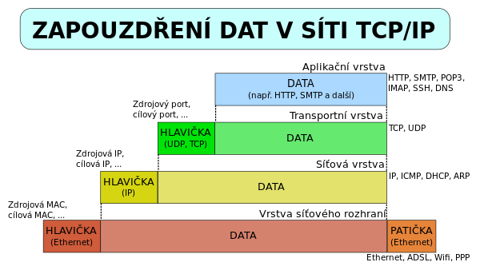

# Otázka č. 4 - Komunikační modely, protokoly sítě

> Vrstvy, vrstevnaté modely, protokoly, historie, důvody vzniku, význam protokolů, data v síti, zapouzdřování, architektura sítí 

>1) vrstevnaté modely ISO/OSI a TCP/IP - význam, důvod vzniku
>2) vrstvy obou modelů - stručný popis vrstev a jejich porovnání
>3) protokoly - význam? enkapsulace? příklady?
>4) rodiny protokolů - význam?

## 1. Vznik ISO/OSI 

- Jednotný standart pro všechny
- Zjednodušení a přehlednost vrstev
- Každá společnost a výrobce měl nějaký svůj způsob (své konvence a protokoly) a je to spíš o 
tom co mají jednotlivé vrstvy obsahovat a dělat. 
- 7 vrstev (původně 13)
- OSI je společnost

## 2. Vznik TCP/IP

- Vzniknul pro ARPANET (předchůdce internetu) – vojenská síť
- Měl pouze 4 vrsty

## 3. Význam

- Různé zařízení a technologie mohou mezi sebou komunikovat 
- Sjednocení struktury a hierarchie pro síťovou komunikaci
- ISO/OSI je méně používaný a je více teoretický
- TCP/IP je praktičtější a využívajího téměř všechna zařízení

## 4. Vrstvy ISO/OSI

## 5. ISO/OSI

### Fyzická vrstva
Protokoly na této vrstvě se zabývají fyzickými aspekty přenosu dat, jako je 
například Ethernet (kabelová síť), Wi-Fi (bezdrátová síť), USB (přenos dat mezi zařízeními).
- Tato nejnižší vrstva se zabývá fyzickými aspekty komunikace, jako jsou kabely, 
elektrické signály a hardwarové rozhraní. Jejím úkolem je převádět bity na fyzické 
médium a zajistit jejich přenos na fyzické úrovni.
### Linková vrstva
Protokoly linkové vrstvy zahrnují Ethernet (pro LAN) a PPP (Point-to-Point 
Protocol pro spojení mezi dvěma body).
- Linková vrstva je zodpovědná za správu spojení mezi dvěma sousedními uzly v 
síti. Zajišťuje detekci chyb v přenosu dat a kontroluje, kdo může na linku vysílat (rozlišení 
přístupu).
### Síťová vrstva
Protokoly na síťové vrstvě zahrnují IP (Internet Protocol), který je klíčovým 
protokolem pro směrování dat v celém internetu.
- Síťová vrstva je zodpovědná za směrování dat přes celou síť. To zahrnuje výběr 
optimální cesty pro přenos dat od zdroje k cíli a zajištění, že data dorazí na správné místo.
### Transportní vrstva
Transportní vrstva obsahuje protokoly jako TCP (Transmission Control Protocol), 
který zajišťuje spolehlivý přenos dat, a UDP (User Datagram Protocol), který je používán 
pro nespolehlivý přenos dat.
- Transportní vrstva zajišťuje spolehlivý přenos dat mezi koncovými body. Používá 
protokoly, jako je TCP, který zajišťuje, že data jsou doručena v pořadí a bez chyb, a UDP, 
který umožňuje nespolehlivý přenos.
### Relační vrstva
Relační vrstva není tak často používána v praxi a obvykle zahrnuje specifické 
protokoly pro řízení relačních spojení, které mohou být součástí některých aplikací nebo 
databázových systémů.
- Relační vrstva zajišťuje správu relačního spojení mezi koncovými body. Její role 
je synchronizovat a spravovat dialog mezi koncovými body, což zahrnuje také obnovu 
komunikace po přerušení.
### Prezentační vrstva
Prezentační vrstva obvykle zahrnuje protokoly pro kódování, kompresi a 
šifrování dat, aby byla zajištěna jejich správná prezentace a zabezpečení. Příkladem může 
být SSL/TLS pro zabezpečenou komunikaci.
- Prezentační vrstva se zabývá převodem dat do formátu, který může být použit 
koncovými aplikacemi. To zahrnuje šifrování, kompresi a konverzi mezi různými kódovými 
sadami.
### Aplikační vrstva
Aplikační vrstva obsahuje protokoly, které jsou přímo součástí konkrétních 
aplikací. Příklady zahrnují protokoly pro e-mail (SMTP), přenos souborů (FTP), webovou 
komunikaci (HTTP), DNS (Domain Name System), a mnoho dalších.
- Aplikační vrstva obsahuje samotné aplikace, které komunikují prostřednictvím 
sítě. Zde jsou konkrétní aplikace a služby, jako e-mailové klienty, webové prohlížeče, FTP 
klienty a další.

## 6. TCP/IP

### Vrstava síťového rozhraní
Vrstva síťového rozhraní je ekvivalentem fyzické a linkové vrstvy v modelu ISO/OSI. zajišťuje přístup k médiu, adresaci v lokální síti a řízení přístupů.

### Internetová vrstva
Je ekvivalentem síťové vrstvy v modelu ISO/OSI. Zahrnuje protokoly, jako je IP (Internet Protocol), ICMP (Internet Control Message Protocol) a ARP (Address Resolution Protocol) pro směrování dat v síti.

### Transportní vrstva
Transportní vrstva zahrnuje protokoly jako TCP (Transmission Control Protocol) 
pro spolehlivý přenos dat a UDP (User Datagram Protocol) pro nespolehlivý přenos.
- Transportní vrstva je ekvivalentem transportní vrstvy v modelu ISO/OSI. 
Zahrnuje protokoly, jako je TCP a UDP, pro spolehlivý nebo nespolehlivý přenos dat.

### Aplikační vrstva
Zahrnuje různé protokoly, které jsou součástí konkrétních 
aplikací a služeb. Příklady zahrnují HTTP pro webové prohlížeče, SMTP pro e-mailovou 
komunikaci, FTP pro přenos souborů a mnoho dalších.
- Aplikační vrstva v modelu TCP/IP zahrnuje konkrétní aplikace a služby, jako HTTP 
pro webové prohlížeče, SMTP pro e-mailovou komunikaci, FTP pro přenos souborů a 
mnoho dalších  

## 7. Protokoly

### Význam

- Stanovují pravidla a formát pro komunikaci
- Umožnují spolehlivou a standardizovanou komunikaci

### Enkapsulace/ Dekapsulace
- Balení dat před odeslán
- V každé v té vrstvě se přidává vlastní hlavička nebo patička pro správnost doručení (například: 
Mac adresa, cílová IP adresa, porty apd.)
- Enkapsulace je zabalení a dekapsulace rozbalování

### Rodina protokolů
- sada protokolů, které navzájem spolupracují
- nelze kombinovat protokoly více rodin v jednom přenosu
- každý protokol v rodině má svůj účel
- příklad: TCP/IP
  - samotné protokoly v této vrstvě nestačí
  - potřebujeme kombinaci alespoň 4 (4 vrstvy)
  - IP, UDP,TCP,HTTP
