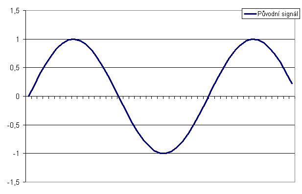
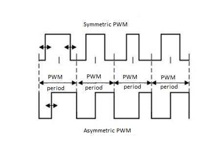
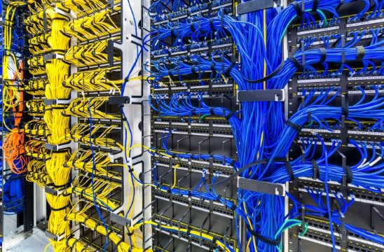

# Otázka č. 6 - Fyzická vrstva

> Význam vrstvy, přenos dat – PDU, signál symetrický/asymetrický, pásmo základní/přeložené, strukturovaná kabeláž

>1) vrstvy ISO/OSI modelu - pouze seřazeně vypsat :)
>2) význam vrstvy a její úkoly, která zařízení pracují na této vrstvě?
>3) přenosová média - rozdělení a jejich popis - rozepiš se (výhody, nevýhody, vlastnosti,
   vzdálenosti, kategorie…)
>4) vysvětli pojmy - duplex, IEEE 802.3, IEEE 802.11, šířka pásma, propustnost
>5) co můžeme říct o kabelu s označením 1000BASE-T a 100BASE-LX10

## 1. Význam

- Nejnižší vrstva v modelu ISO/OSI
- Zajišťuje přenos bitů po komunikačním kanálu, pomocí elektrických, optických nebo bezdrátových signálů
- mechanismy pro detekci chyb v přenesených datech
- Určuje rychlost přenosu a šířku pásma
- Definuje fyzické vlastnosti přenosového média
- Zajištujě synchronizaci mezi vysílačem a přijímačem

## 2. Přenos dat

- bity (0,1)
- Změna napětí nebo světelného signálu 
- Přenosové médium (kabel, optické vlákno, bezdrátově)
- Přenosová rychlost (bit/s)
- Příklad: 101011010110010110

## 3. Signály 

### Symetrický 

-  změna napětí nebo amplitudy signálu při přechodu z jednoho stavu na druhý je stejná jako při přechodu z druhého stavu zpět
- diferenciální signálové páry (Ethernet, USB)

### Asymetrický

- Změna z jednoho stavu na druhý může být odlišná od změny z druhého stavu zpět.
- Jednoduchý sériový signál 

## 4. Pásma

### Základní

- frekvenční složka blízko nule
- digitalní signal (přenos dat přes vodiče)
- nejsou modulovány na vyšší frekvence

### Přeložené

- modulovány nebo posunuty na vyšší frekvence
- použito pro bezdrátovou komunikaci
- může obsahovat více různých frekvencí 

## 5. Strukturovaná kabeláž

- obecné označení metalických a optických prvků, které umožňují propojení jednotlivých uživatelů v rámci počítačové sítě.

#### Telekomunikační zásuvky

- připojení koncových uživatelských zařízení
- dvouproudové provedení
    - připojení počítače, notebooku
    - připojení telefonu

#### Patch panel

- umístěny v rozvaděčích v telekomunikační místnosti
- slouží správci sítě k připojení jednotlivých uživatelů do aktivních zařízení (switch)

#### Horizontální kabely

-  čtyři kroucené páry
-  propojují telekomunikační zásuvky a patch panely.

#### Patch kabely

- připojení uživatelských zařízení do počítačové sítě na straně telekomunikačních zásuvek a připojení jednotlivých portů patch panelů do aktivních zařízení na straně rozvaděče.

#### kategorie podle výkonnosti 

- Cat 3. (10 Mbit/s)
- Cat 5. (100 Mbit/s)
- Cat 5e. (1 Gbit/s)
    - šířka pásma 100 MHz
- Cat 6. (1 Gbit/s)
    - šířka pásma 250 MHz
- Cat 6a. (10 Gbit/s)
    - šířka pásma 500 MHz
- Cat 7. (10 Gbit/s)
    - šířka pásma 600 MHz
- Cat 7a. (10 Gbit/s)
    - šířka pásma 1000 MHz
- Cat 8. (25/40 Gbit/s)
    - šířka pásma 2000 MHz

