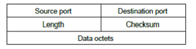
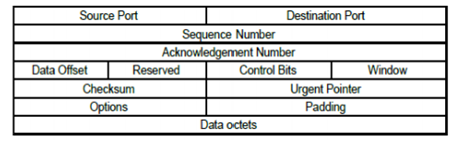

# Otázka č. 9 - Transportní vrstva

> Význam vrstvy, možnosti adresování TCP/IP, TCP, UDP, vztah k sítí nezaložených na IP

>1) vrstvy ISO/OSI modelu - pouze seřazeně vypsat :)
>2) význam vrstvy a její úkoly
>3) TCP a UDP - popis, PDU (co za údaje najdeme v hlavičkách?), použití obecně a na příkladech
>4) porty - význam, rozdělení, princip přiřazování… + příklady
>5) co je to segmentace (jak se liší od fragmentace?), multiplexing, socket pair

# 1. Význam

- Jedná se o čtvrtou vrstvu ISO/OSI modelu 
- Umožňuje paralelní (vícenásobnou) komunikace zařízení v síti
- Segmentuje zprávy
- Může provádět detekci chyb
- Využívá dva transportní protokoly TCP a UDP
- Vytváří na PC přes 65 000 portů

## Funkce 

- Segmentace dat a řízení každého segmentu
- Znovu složení jednotlivých segmentů do tvaru původní zprávy
- Identifikace různých aplikací

## Postup

zabalení do segmentu (zdrojový a cílový port) -> poslaní do síťové vrstvy -> znovu do transportní (u daného zařízení) -> robalení a poslaní na daný port

# 2. TCP UDP

## UDP

- Header: 8 bytes
- Není nutno vytvářet spojení
- Kontrola pomocí 16-bit checksum
- Packet je poslán vždy jednou
- Checksum je povinný u IPv6 (když u IPv4 není, je 0)

### využítí

- Videa, záznamy z kamer, telefony
- Všude, kde je důležitá rychlost

### Výhody/Nevýhody

#### Výhody

- Rychlost
- Jednoduchost

#### Nevýhody

- Packet je poslán vždy, nehledě na vytíženost sítě
- Pokud je packet poškozen, není poslán znova

- **Source port:** Zdrojový port, pokud proces nepodporuje zdrojový port, může být 0
- **Destination port:** Určuje cílový port, kam budou data doručená
- **Length:** vyjadřuje délku UDP hlavičky a dat
- **Checksum:** kontrolní součet, pokud není povinný je 0 (povinný pouze u IPv6)

## TCP

- Header: 20 bytes
- Spojově orientovaný, je nutno vytvořit spojení
- Řízení toku dat, pokud je síť zatížena, počká a data odešla později
- Spolehlivé doručení zprávy, po přijetí vrátí zprávu o doručení, pokud zpráva nedojde do X sekund, odesílatel pošle data znova
- Checksum, povinný jak i IPv4 tak i IPv6

### Využítí

- Maily, webové stránky, soubory
- Kdekoliv, kde nesmí dojít ke ztrátě dat

### Výhody/Nevýhody

#### Výhody

- Spolehlivost
- Správné doručení

#### Nevýhody

- Pomalejší než UDP
- Velká hlavička

# 3. Síťový socket

- Koncový bod připojení přes počítačovou síť
- Obsahuje zdrojovou a cílovou IP adresu

## Datagramový socket

- Nespojové sokety, užívají UDP

## Streamový socket

- Známé jako spojové sockety, využívá TCP

## RAW SOCKET

- Obvykle k dispozici ve směrovačích (routerech) a dalších síťových zařízeních 

