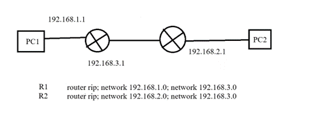
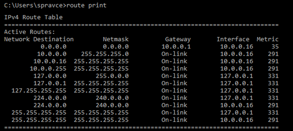

# Otázka č. 20 - Směrovací protokoly

> Popis charakteristických parametrů RIP1, RIP 2, EIGRP, OSPF, metody výběru cesty, vznik směrovací tabulky, nasazení a konfigurace směrovacích protokolů

>1) Jaký je význam dynamických směrovacích protokolů? Kdy je vhodné je použít oproti
    statickému směrování?
>2) Na jaké dvě základní skupiny dělíme dynamické směrovací protokoly? Popiš rozdíl mezi těmito
   skupinami.
>3) Popiš jednotlivé směrovací protokoly (RIPv1, RIPv2, EIGRP, OSPF). Uveď skupinu, stručně
   popiš fungování, metrika, výhody či omezení… Jaký má význam SingleArea a MultiArea v
   případě OSPF?
>4) Směrovací tabulka (primárně ta co je na routeru) - jak vypadá, co v ní najdeme za údaje? Co znamenají označení C, L, S, S*, O, případně další?

## 1. Dynamické směrovací protokoly

- Dynamické směrovací protokoly automaticky aktualizují směrovací tabulky, když dojde ke změně v topologii sítě. 
- Pokud dojde k výpadku linky nebo se přidá nový router, dynamické směrovací protokoly to detekují a automaticky upraví směrovací tabulky.
- Ideální pro velké sítě, kde by bylo statické směrování velmi náročné na správu.
- Umožňují síti růst a měnit se bez nutnosti manuálního zásahu.
- Jsou schopny vypočítat nejlepší cestu k cílové síti na základě různých metrik, jako je počet skoků, šířka pásma, zpoždění atd.

### Dynamické vs. Statické směrování

- Dynamickou jsou více vhodné pro velké sítě, kde by bylo statické směrování velmi náročné na správu.
- Statické směrování je vhodné pro malé sítě, kde je topologie stabilní a nemění se často, též poskytuje více kontroly nad směrováním.

## 2. Rozdíly mezi dynamickými směrovacími protokoly

### Distance Vector

- tyto protokoly používají metriku, která je založená na vzdálenosti (například počet skoků) k cílové síti.
- Každý ryouter udržuje tabulku, která obsahuje nejlepší cestu k cílové síti a vzdálenost k této síti.
- Jsou jednodušší a méně náročné na zdroje, ale mohou být méně přesné.
- Příklady: RIP, EIGRP, RIPv2

### Link State

- Tyto protokoly používají sofistikovanější metriku než pouze vzdálenost. Mohou zahrnovat šířku pásma, zpoždění, spolehlivost a další faktory.
- Každý router udržuje komplexní databázi stavu všech ostatních routerů v síti.
- Poskytují více detailní a přesné informace o síti, ale jsou náročnější na zdroje a komplexnější na implementaci.
- Příklady: OSPF, IS-IS

## 3. Směrovací protokoly

### RIP

- vektorový směrovací protokol
- Využívá metriku založenou na počtu skoků
- Maximální počet skoků je 15
- jeden z prvních protokolů používaných v IPv4 sitích

### OSPF 

- směrovací protokol stavu spojení
- Využívá metriku založenou na nákladech
- Interní směrování
-	DR – hlavní router, který komunikuje s ostatními
-	BDR – Záložní router, který převezme roli DR 

-	Příkaz: router ospf 1; network 192.168.23.0 0.0.0.255 area 0
-	Možnost mít více areí, s tím že musí existovat vždy 0

#### SingleArea

- Všechny routery v jedné oblasti
- Je jednodušší na konfiguraci a správu.
- Sdílejí stejné informace o stavu spojení ve svých databázích

#### MultiArea

- Rozdělení sítě na více oblastí (vždy musí existovat oblast 0)
- Každá oblast má svůj vlastní LSDB(Link-state database) a routery v rámci stejné oblasti sdílejí stejné informace o stavu spojení.
- Router, který je připojen k více než jedné oblasti, se nazývá Area Border Router (ABR) a slouží jako prostředník pro sdílení informací mezi oblastmi.
- Poskytuje větší flexibilitu a škálovatelnost pro velké sítě.

### EIGRP

- vyvinutý společností Cisco
- hybridní protokol, který kombinuje vlastnosti vektorových a stavových protokolů

### BGP

- aktuální verze BGP-4
- Směrovací protokol pro směrování mezi autonomními systémy
- Používán na globální úrovni

### IS-IS 

- IS-IS je Interior gateway protocol (IGP), který slouží pro výměnu směrovacích informací v rámci administrativní domény nebo sítě
- směrovací protokol stavu spojení
- Vyvinut pro telekomunikační sítě, interní směrování

### RIPv2 

- posílá aktualizace směrovací tabulky jako Multicast
- Rozšířená verze protokolu RIP
- Využívá Multicast místo broadcastu
- Podporuje VLSM, CIDR, autentizaci, směrování multicastu
- podpora IPv6

## 4. Směrovací tabulka

- slouží pro směrování dat procházejících počítačovou sítí
- obsahuje zjednodušený obraz topologie sítě
- vytvářena při konfiguraci síťového subsystému
- **statické záznamy** jsou vytvářeny správcem sítě
- **dynamické záznamy** jsou zařazovány i odebírány pomocí směrovacích protokolů(RIP, OSPF)
- Při zpracování datagramu je cílová adresa porovnána se záznamy ve směrovací tabulce

- Obsahuje
    - Cílová síť
    - Maska podsítě
    - Next-hop
    - outgoing interface
    - metrika

- Označení
    - **C** - Přímo připojené sítě. Označuje že je síť připojena k routeru
    - **L** - Lokální směrovaní. Síť je používána lokálně na daném zařízení (loopback adresa)
    - **S** - Statické směrovaní. Nastavena administrátorem
    - **"S/*"** - Statické směrování, který je kandidát na default route
    - **O** - Dynamické směrování (OSPF)
    - **R** - Dynamické směrování (RIP)

- lze též nastavit default route, když neexistuje žádné další specifické routování

