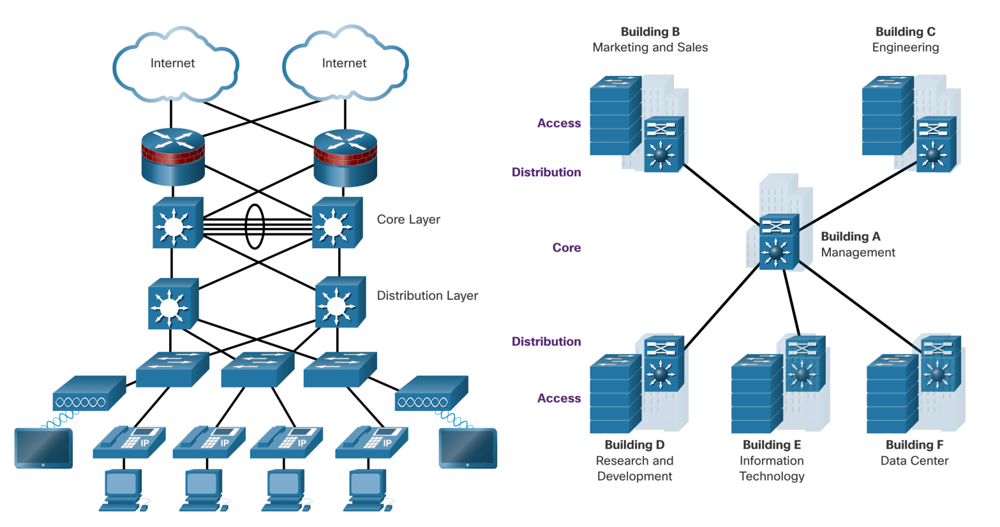
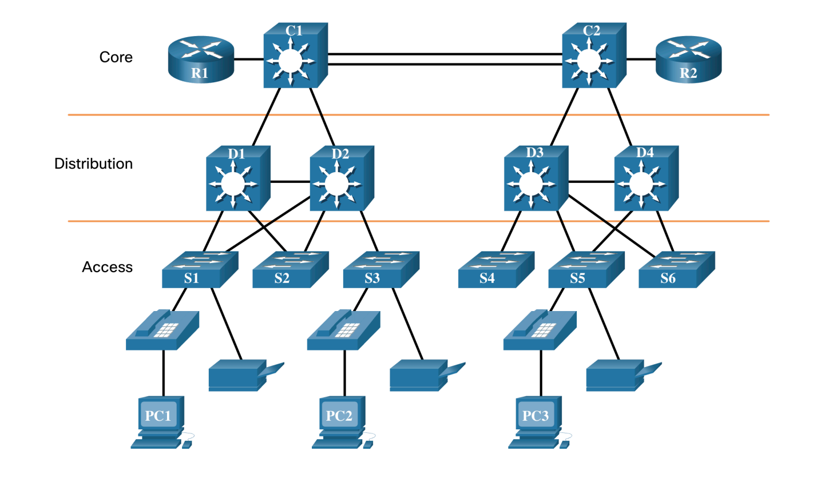

# Otázka č. 21 - Lan design

> Třívrstvý Cisco hierarchický model, technická realizace struktury modelu, volba vhodných přístrojů pro prostředí LAN, význam modulárního řešení modelu ve firemním prostředí, rozvoj IT a síťový model 

>1) Hierarchický model - jaký má význam? Popiš jednotlivé vrstvy a jejich funkci.
>2) Jaká zařízení bys použil na jaké vrstvě? Vybraná zařízení stručně popiš.
>3) Jaký význam může mít použití VLAN v designu sítě? Uveď na příkladu.
>4) V menších firmách můžeme použít redukovaný (dvouvrstvý) model… co o něm víš? (stručně)

## Lan Desing

- správná síť by měla být dostatečně výkonná, zabezpečená, využívat moderní technologie…
- zároveň ale musí umožňovat připojení i starších zařízení a technologií
- musí také umožňovat jednoduchou modifikaci (například rozšíření v případě potřeby)
- ideálně centrálně spravované
- jedná se samozřejmě o větší sítě… firma, kampus… na domácí síti tohle budete těžko
  praktikovat :D

### Základní pojmy:
1) Hierarchie (vrstvy) - rozdělení do vrstev, kde každá vrstva má svůj úkol - každé zařízení má
   tedy svůj smysl, zajišťuje to přehlednost, jednoduší nasazení a management…
2) Modularita - vlastnost sítě umožňující reagovat na potřeby - rozšíření sítě, přidání funkcí…
3) Spolehlivost (odolnost) - síť musí být nonstop funkční
4) Flexibilita - schopnost využít pro svůj provoz všechny prostředky… (aby nějaké zařízení
   neleželo nevyužité)

### Cisco třívrstvý model
- skládá se ze tří vrstev - Core (jádro), Distribution (distribuce), Access (přístup)
- použití v opravdu velkých sítích, kde má firma například několik poboček, či kampus o několika
  fakultách…
- Core Layer - páteřní síť - vysoce výkonné zařízení (router, multilayer SW), které propojuje
  například různá místa v kampusu… takový centrální bod…
- Distribution Layer - například rozvodná síť v rámci nějaké lokality… zajišťuje rychlý a spolehlivý
  přenos dat, typicky propojení switchů, multilayer switchů.. použití VLAN a jiných služeb…
- Access Layer - propojení jednotlivých PC a jiných koncových zařízení se zbytkem sítě, typické
  použití switchů

- například naše škola… dva routery na propojení se světem (core), centrální switche na každém
    patře (distribution) - zařízení těchto dvou vrstev jsou různě propojená pro případ selhání, no a v
    každé učebně switch pro připojení PC (access layer)
- pro menší firmy a sítě je vhodné použít zmenšený model, který se skládá pouze ze dvou vrstev,
  kde je core a distribution layer spojená
- můžete si to představit třeba jako dva centrální switche (core/distribution), na které jsou
  napojené jednotlivé switche z různých místností (co místnost, to switch - access layer)

### Vužití vlan
- lze pomocí nic designovat více sítí v jedné fyzické infrastruktuře
- například v jedné budově můžete mít několik oddělených sítí - jedna pro studenty, druhá pro
  učitele, třetí pro administrativu…
- výhoda je, že se jedná o logické oddělení, takže se nemusíte starat o fyzické propojení…
- také je možné nastavit různá pravidla pro jednotlivé sítě (například jiná práva přístupu)
- VLAN můžete využít i pro rozdělení sítě na různé služby (například hlasovou a datovou) - zvýšení výkonu sítě
- VLAN můžete využít i pro zvýšení bezpečnosti sítě - například oddělení serverů od ostatních
  zařízení

### Na co myslet
- “myslet na budoucnost” = plánovat tak, abyste mohli jednoduše síť rozšířit - používat zařízení,
  která se dají jednoduše upgradovat/modifikovat (například přídavné moduly…)
- při návrhu rozdělení adres (podsítě) počítat i s budoucí potřebou rozšíření - ať už rozšíření
  aktuálních podsítí, nebo vytvoření nových
- redundance - záložní cesty, záložní zařízení… aby v případě selhání nějakého prvku síť fungovala dál
- agregace - spojení více linků do jednoho, tím dosáhnout vyšší rychlosti, spolehlivosti
- Využívat chytrých protokolů (např. OSPF), nastavit arey, šteření výpočetní náročnosti na routery
- Zabezpečení sítě - Vlan, ACL, VPN, AAA
- použití bezdrátových technologií pro access layer (typicky připojení laptopů, mobilu…)
