# Otázka č. 2 - Tiskárny a scannery

## Tiskárny lze rozdělit do dvou hlavních kategorí. Impaktní a neimpaktní

## **Impaktní**

## Jehličková tiskárna

### Princip

Při průchodu proudu cívkou, čímž vznikne elektromagnet, se jehlička vysune proti válci, narazí na barvící pásku a přes ni vytiskne na papír bod. Jehličky jsou seřazeny do sloupce a tisková hlava se postupně posouvá podél válce a tiskne jednotlivé sloupce. Z nich se pak skládají jednotlivé znaky nebo grafické symboly. Tyto tiskárny mohou tisknout libovolné typy písma a znaky.

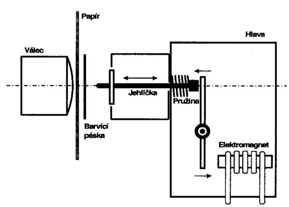

### Výhody

- Nízké náklady na tisk
- Vysoká odolnost tisku
- Schopnost tisknout souběžně

### Nevýhody

- nízka kvalita tisku
- hlučnost

### Využítí

- tisk faktur, dokladů a dalších dokumentů
- tisk šeků, výpisů účtů
- tisk štítků, štítků na palety a dalších průmyslových potřeb

## **Neimpaktní**
## Ternální tiskárny

### Princip
Přeným ohříváním papíru vzniká na papíru obraz. Barva není obsažená v tiskárně, ale v papíru. K ohřevu se využívá převážně laser, ale lze využít i jehlu, proto tuto tiskárnu lze řadit jak do impaktních, tak neimpaktních tiskáren.

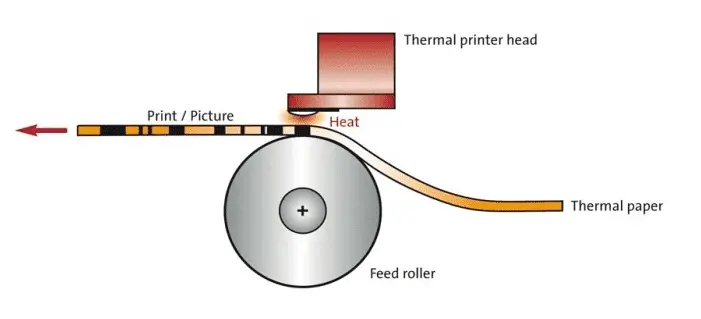
### Výhody

- Rychlost
- Dlouhá životnost
- Levný tisk

### Nevýhody

- Obsah po nějakém čase zmizí
- Nižší kvalita - pouze text či nekvalitní obrázky

### Využití
- Tisk účtenek
- Tisk jízdenek

## Inkoustová tiskárna

### Princip

Tiskárna využívá kapilárního efektu, kdy se kapalná barva nasaje do trysky a následně se pomocí ohřevu vytvoří kapka, která se vystříkne na papír. Tiskárna může mít jednu nebo více trysk, které mohou být buď v jedné tiskové hlavě nebo v samostatných cartridgech.

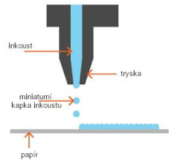

### Výhody

- Vysoká kvalita tisku
- Schopnost tisknout fotografie
- Široká dostupnost
- Tichý provoz

### Nevýhody

- Vysoké náklady na spotřební materiál
- Pomalý tisk
- Náchylnost na rozmazání

### Využití

- Tisk fotografií
- Tisk dokumentů
- Tisk plakátů

## Termosublimační tiskárna

### Princip

Termosublimační tiskárna pracuje tím, že speciální barvy ve formě voskových nebo želatinových kazet, které jsou zahřívány, aby se změnily z pevného stavu na plynný stav. Tento plyn poté pronikne do povrchu speciálního tiskového média a změní jeho barvu. Využívá barevné schéma CMYK. 

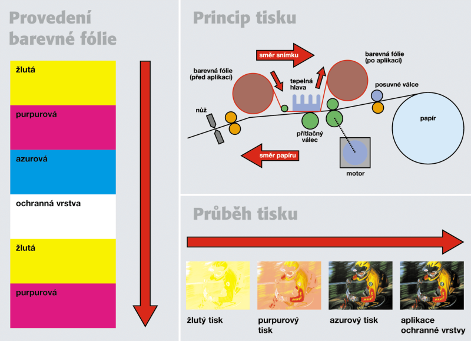

### Výhody

- Vysoká kvalita tisku
- Schopnost tisknout fotografie
- Tichý provoz
- odolnost vůči otěru

### Nevýhody

- Vysoké náklady na spotřební materiál
- Pomalý tisk
- speciální typ tiskového média

### Využití

- Tisk fotografií
- Tisk dokumentů
- Tisk plakátů

## Laserová tiskárna

Laserová tiskárna využívá principu elektrofotografie. Nejprve se na válec s fotovodivým povrchem nanesou náboje pomocí koronového drátu. Poté se na válec vystříkne laserový paprsek, který rozloží náboje na místech, kde se má tisknout. Toner, který je elektricky nabitý, se přitáhne k válečku a přenese se na papír. Nakonec se toner zahřeje a přitlačí k papíru, čímž se fixuje.

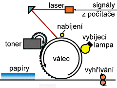

### Výhody

- Vysoká kvalita tisku
- Rychlý tisk
- Vysoká přesnost
- Nízké náklady na tisk

### Nevýhody

- Vyšší pořizovací cena
- Náchylnost na závady
- Nemožnost tisku fotografií

### Využití

- Tisk dokumentů
- Tisk letáků a brožur
- Tisk etiket a štítků

## Skener

### Princip

Skener využívá principu, kdy se světlo odražené od dokumentu zachytí a převede na digitální obraz. Tento obraz je následně digitalizován a uložen do počítače.

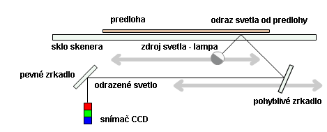

### Výhody

- Rychlý přenos dat
- Vysoká kvalita skenování
- Možnost skenování do různých formátů

### Nevýhody

- Vyšší pořizovací cena
- Náročnější obsluha
- Nemožnost skenování větších formátů

### Využití

- Digitalizace dokumentů
- Digitalizace fotografií
- Digitalizace kreseb a plánů

# 3D tiskárny
3D tiskárny lze rozdělit do dvou kategorií. FDM a SLA

## FDM tiskárny
Nejrosšířenější forma 3D tisku. Funguje na principu skládání modelu z jendotlivých vrstev z roztaveného plastu. 
FDM tiskárna tlačí strunu materálu do trysky pomocí tzv. extruderu. Jedná se o krokový motor s dvěmi protilehlými koly, které tlačí na fialment a ženou ho dále.
Další zastávkou materiálu je tzv. hotend, který vypadá nějak takto. Vzhled se samozřejmě u jednotlivých tiskáren liší.
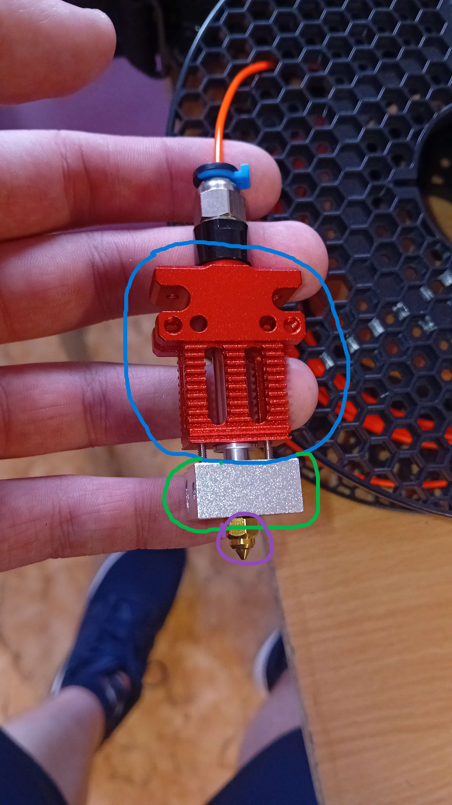

Modrá - **Chladič** - Tato část je připevněná k tiskárně, musí být chlazená ventilátorem, aby nedocházelo k předběžnému tavení materiálu a zároveň aby se nepoškodila tisková hlava, ke které je hotend přichycen.
Zelená - **Heatblock** - V této části dochází k samotnému tavení plastu. V dírách viditelnách vlevo se po složení nachází topné těliské a termistor, kteří společně udržují nastavenou teplotu, která je obvykle kolem 220°C.
Fialová - **Tryska** - Po roztavení je materiál vytlačen tryskou, ta nám slouží ke snížení průměru vytlačeného vlákna. Standardní průměr trysky je 0,4mm. Velikosti se ovšem mohou pohybovat od 0,2mm až po 1,2mm.

Jako materiál pro 3D tisk se používá tzv. filament. Nejrozšířenějším typem je **PLA.** 
Dalšímy typy materiálů jsou PETG, TPU, PC nebo PP. Každý z těchto plastů má své využití a je vhodný pro jiné aplikace (Na konci je vypíšu, kdyby to někoho zajímalo)

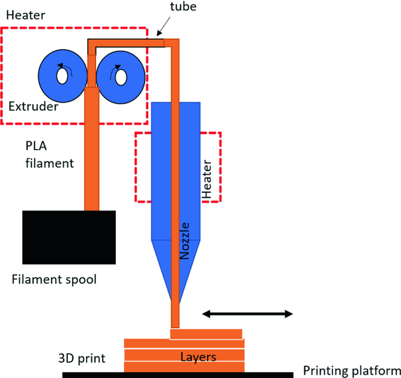

### Výhody

- Oproti SLA levnější (Záleží na materiálu)
- Levnější tiskárny
- Nejsou toxické či jinak škodlivé (Většinou)
- Nevyžadují žádný post-procesing

### Nevýhody

- Více objektů = delší doba tisku
- Oproti SLA hlučnost
- Ne až tak vysoká kvalita

### Využití

- Tisk funkčních dílů
- Tisk dekorativních objektů
- Tisk náhradních dílů

### Materiály
- PLA - Nejběžnější materiál, jednoduchý na tisk a relaticně nízká cena. Je i docela odolný, ale nevhodný ven, degraduje.
- PETG - Druhý nejrosšířenější materiál. Slouží převážně k tisku odolných funkčních součástek. Vhodný i ven, nedegraduje. Stejný materiál jako PET lahve, jen s příměsmi pro lepší tisk (to je to G)
- TPU - Ohebný materiál, lze z něj tisknout pouzdra na telefony, kamery či podobná zařízení. Je ale poněkud dražší a není tak jednoduché s ním tisknout.
- ASA, ABS - Tyto plasty dávám k sobě, protože jsou velice podobné co se vlastností týče. Jsou to opět velice odolné plasty, jsou ale velice citlivé na okolní vlivy jako je vítr či změna teploty. Pak se kroutí. Zároveň asa vypouští toxické plyny, proto je třeba být ve větrané místnosti nebo tisknout v uzavřené komoře s fitrováním vzduchu.
- PC (Polykarbonát) - Je to jeden z nejodolnějších materiálů, který se běžně používá. Má ovšem problémy s přilnavostí k podložce, takže je obtížnější s ním tisknout. Mechanicky je ale velice odolný.
- PP (Polypropylen) - Tento druh plastu je velice odolný jak chemicky, tak i mechanicky. Je pouze pár sloučenin, které by byly schopny rozpustit PP. Je zároveň mechanicky odolný, tento plast se spíše ohýba než aby praskal. Na tisk je ale poněkud náročný, protože má tendenci se kroutit, proto je nejlepší způsob tisknout na izolepě z PP, ke které se přilepí nejlépe.

Materiálů je samozřejmě o dost víc, tohle je jen výpis těch základních.

## SLA tiskárny
Tento typ tiskárne není až tak běžný, ale i tak jej spousta lidí využívá. A to z dobrého důvodu. Narozdíl od FDM tiskáren, SLA dokážou tisknout vysoce detailní součástky a díly. Tyto tiskárny namísto postupného nanášení vrstvy plastu využívají pryskyřici citlovou na UV světlo, které pod ním tvrdne. Této pryskyřici se říka **resin**. Narozdíl od FDM, tato tiskárna tisne celou vrstvu najednou, takže je úplně jedno, jak široký je můj objekt nebo kolik jich tisknu, čas mi zvyšuje jen výška výtisku.

Tato tyskárna se skládá se tří hlavní částí. Tisková platforma, displej a UV lampa. Tisková platforma se ponoží do vaničky s resinem, následně monochromatický displej propustí světlo jen na určitých místech platformy a tím vytvrdí rezin jen tam, kde potřebuje. Následně se platforma zvedne, aby vytvrzenou vrstvu odlepila a mohl pod výtisk natéct resin nový. Tento proces se opakuje, dokud se nevytiskne celý výtisk.

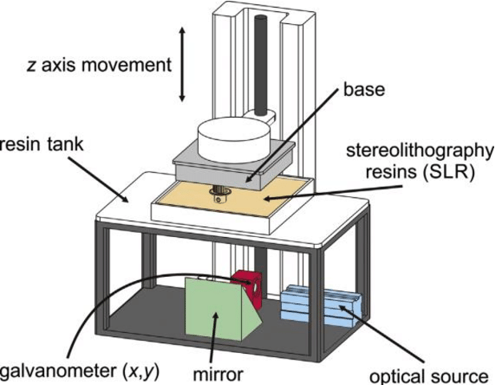

Můžeme si ukázat, jak to vypadá na skutečné tiskárně. Tato tiskárna je Prusa SL1s

Takto vypadá monochromatický displej, který určuje, kde se vytvrdí resin. Ve výchozím stavu je neprůhledný a tiskárna ho zprůhledňuje. Ve vaničce se následně vytvrdí vše, kde je displej průhledný.

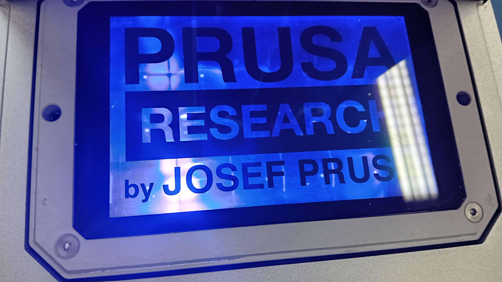

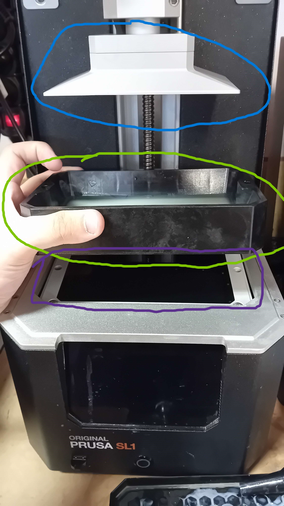

Modrá - Tisková platforma. Na tuto část se výtisk tiskne a tato část se nádledně pohybuje nahoru a dolu.

Zelená - Vanička s resinem. Tato vanička má průhledné dno, přes který prosvítá UV světlo do vaničky.

Fialová - Toto je ten osvitový displej, kerý propouští světlo. Pod ním je schovaná UV lampa.

### Výhody

- Vysoce kvalitní tisk
- Rychlost určená pouze výškou objektu

### Nevýhody

- Pouze malá platforma, například SL1S má pouze 127mm x 80mm
- Tichá
- Resin je poněkud škodlivý, může působit vyrážku na kůži a výpary můžou způsobit astmatickou reakci. Zkrátka rukavice a větrat.
- Cena, resin je oproti filamentu o dost dražší.

### Využití

- Tisk malých figurek s vysokými detaily
- Tisk náhradních dílů, je vhodný ale jen na něco