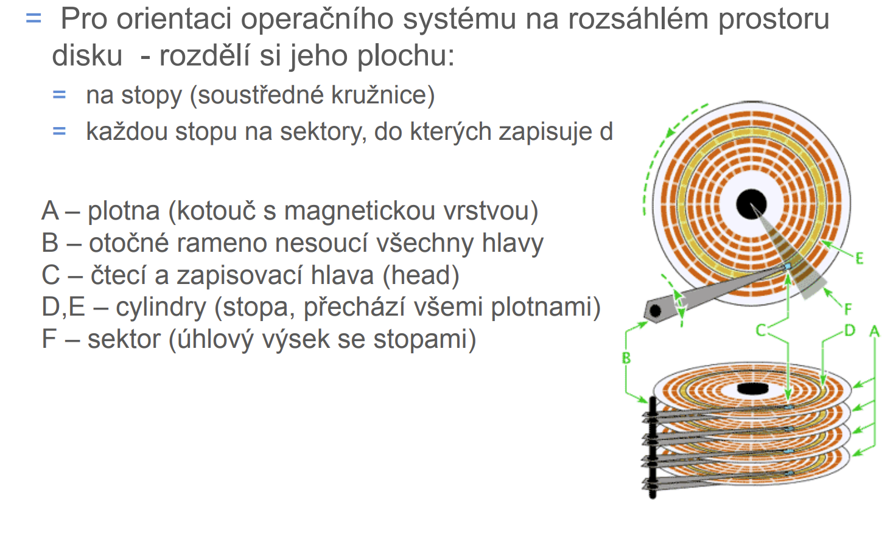
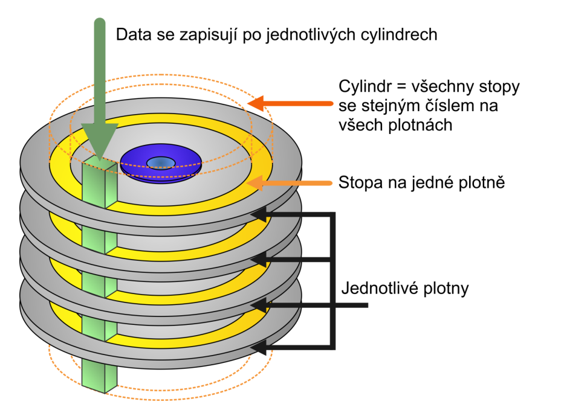

# Otázka č. 4 - Pevný disk HDD a SSD

[Video jak vypadá disk vevnitř](https://youtu.be/ENMHXkwoOik)

- Pevný disk je paměť pracující na magnetickém principu
- Skládá se z několika částí:
- médium, na němž jsou uložena data (3,5“ a 2,5“)
- magnetické hlavy pro zápis a čtení
- mechanika pohybující hlavami
- motorek točící diskem
- elektronika disku řídící práci disku
- desku rozhraní, zajištující připojení HDD z základní desce (Dneska SATA)

## Složení disku

Datové médium HDD je složeno -
- z tuhých kotoučů – ploten, umístěných v několika patrech nad sebou
- data se zapisují do magnetické vrstvy, která je nanesena na každý kotouč
- s tímto povrchem pracují magnetické čtecí/zapisovací hlavy, které se 
vznášejí nad povrchem (μm)

## Prekompenzace

- Díky geometrii disku jsou vnější stopy delší než vnitřní
- sektor stopy 0 (první vnější stopa) je delší než stejný sektor poslední 
stopy, přesto oba sektory nesou stejné množství dat

 Dipóly jsou malými magnety
- mají své severní a jižní póly
- stejné póly se odpuzuji, opačné přitahují
- na vnitřních stopách, kde jsou dipóly blízko u sebe
- hrozí nebezpečí, že při jisté kombinaci kladných a záporných impulsů, např. 
1100..., mohou v důsledku přitažlivých a odpudivých sil vniknout bity do 
sebe, čímž se informace naruší a data budou nečitelná
- Obrana je prekompenzace
- řadič počítá s pohybem dipólů a posouvá zapisované impulsy proti 
směru předpokládaných přitažlivých sil
- bity jsou úmyslně ukládány na geometricky špatné místo, ale působením 
vzájemných magnetických sil se srovnají
- pro prekompenzaci používá zkratka CPZ

## Hlavy a cylindry

- Nad každým povrchem „létá“ jedna hlava
- zapisuje/čte data
- má-li pevný disk 5 kotoučů, může mít až 10 hlav (každý kotouč má 2 
povrchy)
- Všechny hlavy jsou umístěny na společném rameni
- pokud řadič posune hlavu číslo 3 (patřící třetímu povrchu) nad stopu 
134, posunou se i hlavy nad ostatními kotouči naci stopu 134 svého 
povrchu
- díky společnému rameni se tedy hlavy vždy vznášejí nad stejnou 
stopou všech povrchů
- stejným stopám na různých površích se říká cylindr, řidčeji válec

## Cache (Vyrovnávací paměť)
= Stejně jako mikroprocesory i pevné disky používají 
vyrovnávací paměť
= do ní se načítají data z disku a odtud se pak přenášejí na sběrnici
= cache podstatně zrychluje práci 
= dnes o velikosti 8 MB až 256 MB 

## Kapacita
- Je nejdůležitějším kritériem disku
- první počítače IBM-XT vůbec pevné disky neměly
- postupně se začaly objevovat disky s kapacitou 10 MB
- horní hranice kapacity dnešních disků je 32 TB

## SATA

- Jde o sériové rozhraní
- přenosová rychlost SATA je 150, 300 nebo 600 mb/s
- je možné připojení a odpojení disku za chodu
- možnost vytvoření RAID polí
- jelikož jde o sériový přenos nedochází k přeslechům - zvýšení 
frekvence sběrnice