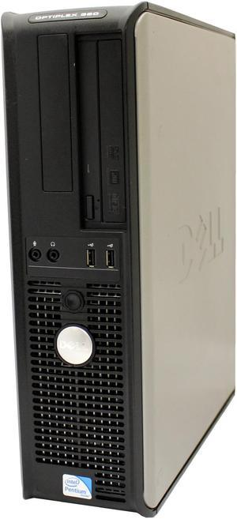
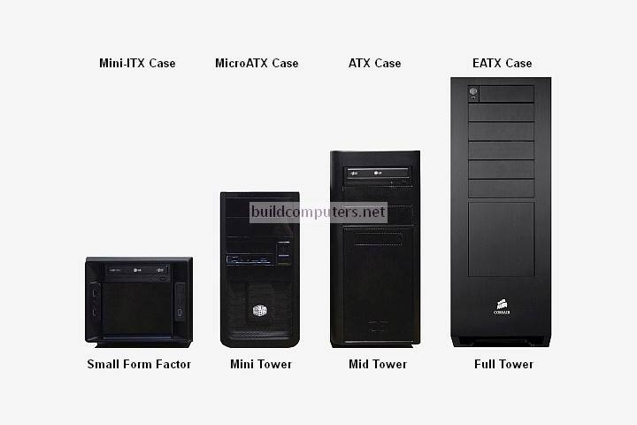
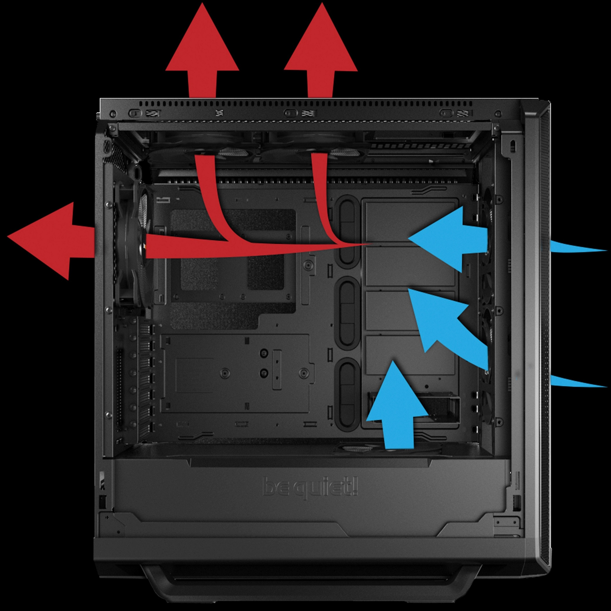
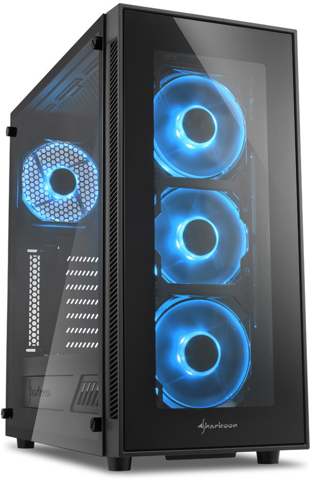
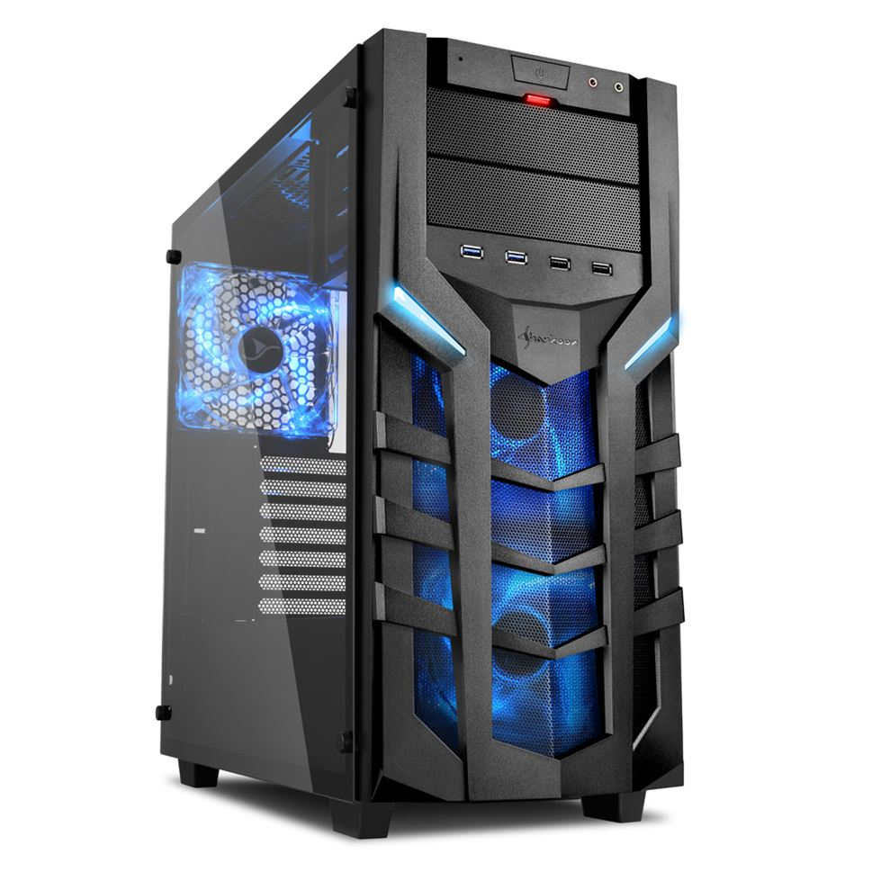
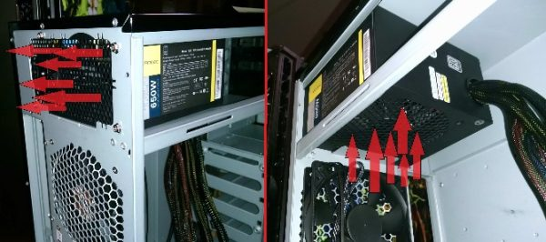
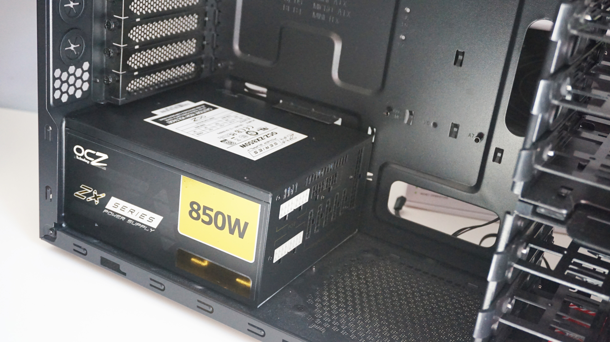
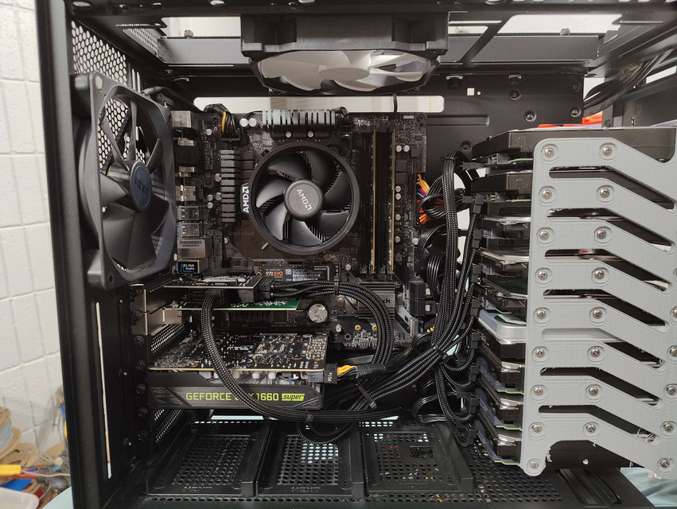
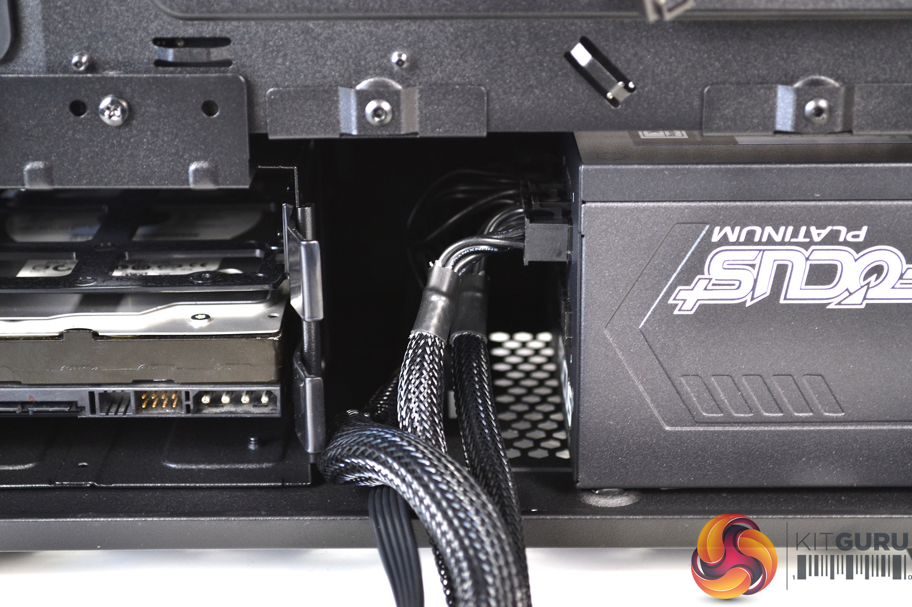
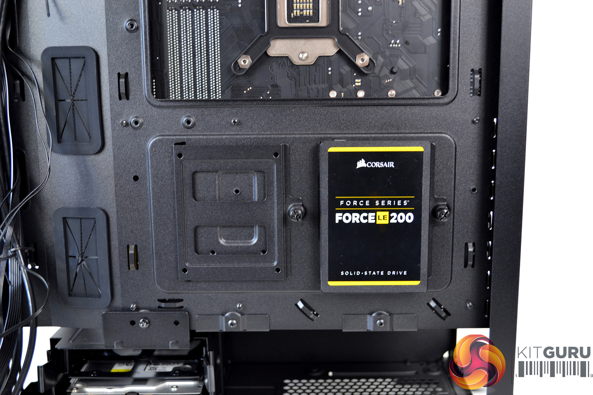

# Otázka č. 5 - Napájecí zdroj, počítačová skříň, cloudovská úložiště a využití AI
[VIDEO](https://youtu.be/YhEinQ2OvlU)

Ke zdroji mě nenapadá nic, co ještě není ve videu.

# Case

Letmý popis ve videu.

## Druhy casů

### Desktop
Desktopové casy se využívaly hlavně dříve, obvykle se dávaly pod monitor na stůl. Proto ten název, DESK-TOP (Na stole)
Dnes už není moc běžný mimo nemocnice nebo nějaké kanceláře

### Tower
Počítačová skříň typu tower je v dnešní době o dost běžnější. Počitačovou skříň typu tower lze rozdělit na několik velikostí.
Nejběžnější velikostí domácího PC je MID tower.

# Obkecávací informace

Vzhledem k tomu, že tohle je fakt hodně otevřená otázka a není zas tak moc podstatných informací, dám sem takový ty věci, kterýma se dá zkrátka zabít čas.

## Airflow (Průtok vzduchu)

Airflow je jedním z faktorů, na který je třeba při výběru casy koukat. Čím lepší airflow, tím lepší odvod tepla z casy a tím pádem nižší teploty komponentů.
K aktivnímu airflow nám napomáhají ventilátory a lze je nastavit do několika konfigurací. Nejběžnější je nasávání vepředu a výfuk vzadu.

Více netilátorů ale nutně neznamená více vzduchu. Spousta beden bude mít zepředu sklo, což má ale velice negativní dopad ta teploty. Bednou pak neproudí takřka žádný vzduch, proto se doporučuje mít vepředu tzv. mesh neboli mřížku. Možná se někomu nemusí tolik líbit, ale výrazně zvýší průtok vzduchu.
Zde je příklad bedny se sklem:

A tady s mesh (Tuhle mám i já)

## Montáž zdroje

- Existuje více možností, jak namontovat PC zdroj. Buď nahoru, nebo dolu. 
- Dříve byl standard mít zdroj nahoře. V některých případěch to byl také jediny vetilátor v PC a tudíž napomáhal chladit systém.

Dnes se převážně z estetických důvodů instaluje zdroj dolů, obvykle i za krytku. Je pak jednodušší schovat kabely.

## Montáž disků

Opět, stejně jako předtím, je více způsobů jak namontovat disk. Dříve se disky montovaly dopředu bedny.

Dnes se ale disky už instalují zezadu, opět z estetických důvodů.

Už mi docházejí nápady. Kdyby někoho ještě něco napadlo, sem s tím.

