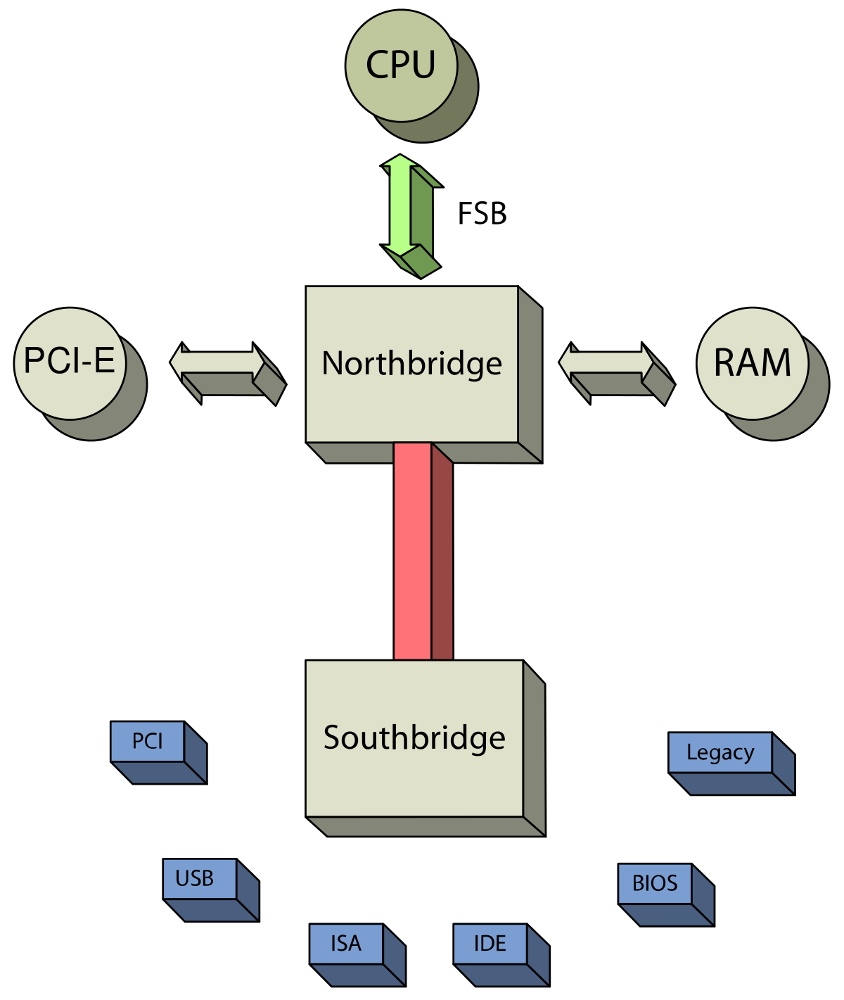

# Otázka č. 6 - Základní deska
[VIDEO](https://youtu.be/IT6pk0Dtf7s)

Popis desky ve videu.

## Velikosti desek
Máme různé velikosti desek pro různé účely. Všechny mají ty samé základní komponenty, jen se obvykle liší počtem PCI a PICe slotů.

## Chipset

Čipset je jeden nebo více čipů, které se starají o komunikace mezi jednotlivými komponenty na desce.

Dříve byl chipset rozdělen na dva čipy, severní a jižní můstek (viz. video). Čipset je takto rozdělený i dodnes, jen je integrovaný v jednom obvodu.
Každý z těchto můstků se stará o jiné komponenty. (obrázek níže)

Při výberu jednotlivých komponent je třeba ohlídat typy slotů jako je patice procesoru, DDR ramky a pod.

Opět mě nenapadá nic, co už není ve videu, takže kdyby někdo něco, klidně přidejte.