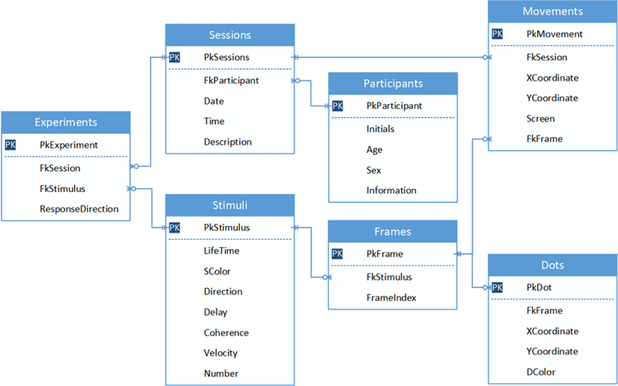
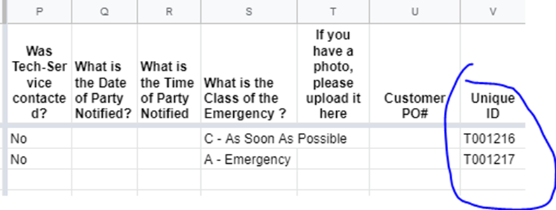

# Otázka č. 16 - Konceptuální model DB, relace a UID

## Konceptuální model DB

- abstraktní reprezentace datové struktury, která se zaměřuje na **vztahy mezi entitami**. Slouží k pochopení, jaké entity jsou součástí systému a jak spolu interagují.
- Konceptuální model je prvním krokem při návrhu databáze a slouží jako základ pro další fáze modelování.
- **Entitně-relační model (E-R diagram)** je jedním z konceptuálních modelů. Pomáhá vizualizovat entity, jejich atributy a vztahy mezi nimi. Například, pokud máme databázi pro knihovnu, mohou entity zahrnovat knihy, autory a výpůjčky. 
    - Entity
        - jsou konkrétní objekty nebo subjekty, které jsou reprezentovány v databázi. 
        - Každá entita má své vlastní vlastnosti, které nazýváme atributy, a může být identifikována pomocí jedinečného identifikátoru. 
        - V případě databáze pro knihovnu mohou entity zahrnovat knihy, autory, čtenáře a další.
    - Třída entit
        - je skupina podobných entit. 
        - Tyto entity mají společné vlastnosti a chování. 
        - Například třída entit "knihy" by zahrnovala všechny knihy v knihovně.
    - Atributy 
        - jsou vlastnosti nebo charakteristiky entit. 
        - Každá entita může mít jedno nebo více atributů. 
        - Atributy mohou být povinné nebo nepovinné. Povinné atributy musí mít hodnotu pro každou instanci entity, zatímco nepovinné atributy mohou být prázdné. 
        - Například atributy knihy mohou zahrnovat název, ISBN, autor, vydavatele a rok vydání.
    - Povinné a nepovinné atributy
        - Povinné atributy jsou ty, které musí mít hodnotu pro každou instanci entity. 
        - Nepovinné atributy mohou mít hodnotu, ale nemusejí. Například v databázi pro knihovnu by atribut "název" knihy mohl být povinný, zatímco atribut "počet stran" by mohl být nepovinný.
    - Relace
        - jsou vztahy mezi entitami, které popisují spojení mezi nimi. 
        - Relace mohou být jednosměrné nebo obousměrné a mohou mít různé stupně. Například v knihovní databázi by existovala relace "napsal", která spojuje entitu "autor" s entitou "kniha", a relace "vypůjčil", která spojuje entitu "čtenář" s entitou "kniha".

## Relace

- Relace jsou spojení mezi entitami v databázi. Jsou to vztahy, které mohou být jednoduché (např. "knihy jsou napsány autory") nebo složité (např. "studenti mají vypůjčené knihy").

- Relace jsou důležité pro pochopení, jak data spolu souvisí. V relačních databázích jsou relace obvykle reprezentovány tabulkami. Většina relací odpovídá přímým vazbám mezi tabulkami.

### Typy relací

#### 1:1

- Tento typ relace znamená, že každý záznam v jedné tabulce odpovídá právě jednomu záznamu v druhé tabulce. 
- Například, v databázi zaměstnanců, každý zaměstnanec má jedinečné ID zaměstnance.

#### 1:N

- Tento typ relace znamená, že jeden záznam z jedné tabulky může odpovídat mnoha záznamům v druhé tabulce.
- Například, jeden oddělení může mít mnoho zaměstnanců.

#### M:1

- Tento typ relace je opakem 1:N relace. Mnoho záznamů z jedné tabulky odpovídá jednomu záznamu v druhé tabulce. 
- Například, mnoho zaměstnanců může patřit do jednoho oddělení.

#### M:N

-  Tento typ relace znamená, že mnoho záznamů z jedné tabulky může odpovídat mnoha záznamům v druhé tabulce.
- Například, studenti (jedna tabulka) mohou být zapsáni do mnoha kurzů (druhá tabulka), a naopak, kurzy mohou mít mnoho studentů.

#### Více násobná relace

- vztah mezi více než dvěma entitami.
- Například relace "student je členem týmu, který je veden trenérem" zahrnuje vztah mezi studentem, týmem a trenérem.

#### N-ární relace

- N-ární relace je obecnější termín pro relaci mezi n entitami, kde n může být libovolné číslo. 
- Například relace mezi studentem, kursem a učitelem je typickým příkladem trojnásobné (ternární) relace. 

### Kardinalita

- udává počet entit v relaci. 
- Může být jednoznačná, pokud existuje přesný počet entit (např. každý student má právě jednu třídu), nebo neurčitá, pokud není počet entit přesně definován (např. student může mít libovolný počet telefonních čísel).

### Optionalita

- určuje, zda musí být vztah mezi entitami vyplněn (povinný) nebo zda může být prázdný (nepovinný). 
- Například u relace mezi studentem a třídou může být třída povinná, protože každý student musí být ve třídě, zatímco u telefonního čísla studenta může být optionalita, protože student nemusí mít telefon.

### Transferabilita

- udává, zda se vztahy mezi entitami mohou přenášet (transferovat) na jiné entity. 
- To znamená, že pokud je relace mezi studentem a třídou, a student opustí třídu, může se tato relace přenést na jinou třídu.

## Unikátní identifikátor (UID)

- unikátní identifikátor, který jednoznačně identifikuje každou entitu v databázi.
- Každá entita by měla mít svůj vlastní UID, aby bylo možné ji jednoznačně identifikovat.
- UID může být číslo, řetězec nebo jiný typ identifikátoru. Existují různé typy klíčů, které mohou být použity k identifikaci entit a udržování integritních vazeb

### Primární klíč (Primary Key)

- specifický kandidátní klíč, který je vybrán pro jednoznačnou identifikaci každé instance entity.
- V relační databázi je primární klíč často používán pro indexaci a zajištění unikátnosti záznamů v tabulce.

### Cizí klíč (Foreign Key)

- atribut nebo soubor atributů, který odkazuje na primární klíč jiné entity. 
- Slouží k vytvoření vztahu (relace) mezi dvěma tabulkami v relační databázi. 
- Zajišťuje integritu referenčního záznamu a umožňuje provádět operace spojené s relacemi mezi entitami.

### Kandidátní klíč (Candidate Key)

- Atribut nebo soubor atributů, který může jednoznačně identifikovat každou instanci entity.
- Může existovat více kandidátních klíčů v jedné entitě.
- Například v entitě "student" by kandidátními klíči mohly být kombinace atributů jako jméno a rodné číslo.

### Přirozený klíč (Natural Key)

- klíč, který je odvozen z přirozených charakteristik entity, jako je například rodné číslo u osoby nebo ISBN u knihy.
- jsou často snadno čitelné a mají význam pro uživatele.

### Umělý klíč (Surrogate Key)

- klíč, který je speciálně vytvořen pro účely identifikace entity a nemá přímý vztah k jejím přirozeným charakteristikám. - Obvykle je to generované číslo nebo kód, který nemá žádný význam pro uživatele, ale je jedinečný a snadno se generuje.

### Jednoduchý klíč (Simple Key)

- klíč složený z jednoho atributu.

### Složený klíč (Composite Key)

- klíč, který je složen z více než jednoho atributu. 
- Tento typ klíče je často používán v případech, kdy jediný atribut není dostatečný pro jednoznačnou identifikaci entity.

### Univerzální unikání identifikátor (UUID)

- formát identifikátoru, který je unikátní na celém světě a je generován pomocí určitých algoritmů. 
- 128 bitový identifikátor, který je obvykle reprezentován jako 32 hexadecimálních znaků oddělených pomlčkami.
- často používá v distribuovaných systémech a aplikacích, kde je potřeba zajistit jedinečnost identifikátorů bez centrálního řízení. 

