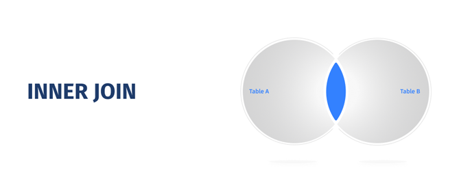
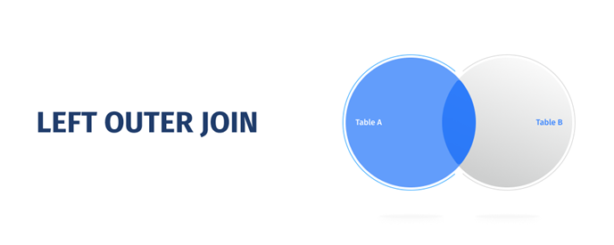
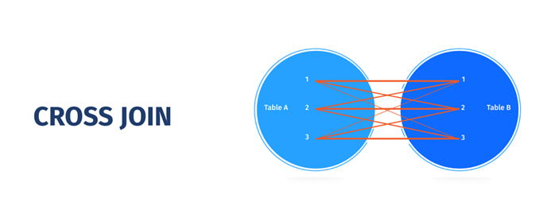
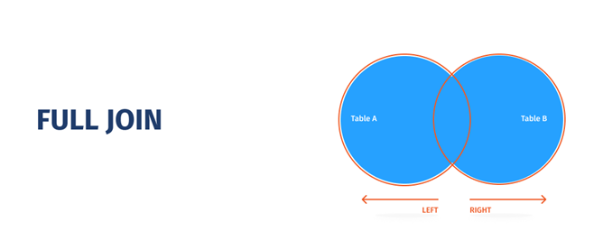

# Otázka č. 20 - DQL SQL, joiny, subquery, view a spojení selectů

## SQL

- Structured query language je programovací jazyk, který dokáže pracovat s databázemi.
- Je standardem pro většinu dnešních databázových systémů. Používá ho mariadb i postgreSQL.

## DQL

- Data query language je podskupina z SQL. 
- Do této skupiny spadají dotazy, které získávají data. Do DQL patří SELECT, HELP a SHOW.

- Získání všech dat z tabulky

### SELECT

- Příkaz, který vrací tabulku vybraných sloupců a řádků z jedné, či více tabulek (za pomocí joinů) 

- Získání všech dat z tabulky

```sql
SELECT * FROM table_name;
```
- získání pouze sloupce column1 a column2 z tabulky

```sql
SELECT column1, column2 FROM table_name;
```

- získání všech řádků, kde column1 obsahuje 'some_value'

```sql
SELECT * FROM my_table WHERE column1 = 'some_value';
```

- získání všech řádků z tabulky a seřadí je podle column1 vzestupně

```sql
SELECT * FROM my_table ORDER BY column1 ASC; 
```

- získání prvních 10 řádků z tabulky

```sql
SELECT * FROM my_table LIMIT 10; 
```

- Získání řádků z tabulek, které jsou spojeny pomocí joinu 

```sql
SELECT * FROM table1 JOIN table2 ON table1.id = table2.id;
```

### HELP

- příkaz který vrací tabulku s krátkým popisem a popřípadě i synatxi dotazovaného příkazu/funkce

```sql
HELP 'search_string';
```

### SHOW

- I tento příkaz vrací tabulku s informacemi o databázích, tabulkách nebo zařízení. Lze najít i autory mariadb pomocí ‘AUTHORS‘.

[Seznam](https://mariadb.com/kb/en/about-show/)

```sql
SHOW DATABASES;
```
## JOIN, spojení tabulek

- Často se setkáváme s tím, že potřebujeme vybrat údaje z více tabulek najednou v jednom příkazu. Tabulky musí mít společnou hodnotu podle které se řádky mohou spojit.
- V joinu uvádíme nejdříve tabulku, kterou chceme připojit a následně v klauzuli ON která funguje jako WHERE pro připojovanou tabulku napíšeme podmínku jak chceme spojit naše tabulky.

### INNER JOIN

- spojí tabulky podle hodnot jen tehdy pokud se hodnoty spojují. t1.id se musí shodovat s t2.id.

```sql
SELECT * FROM t1 INNER JOIN t2 ON t1.id = t2.id;
```


### LEFT JOIN

- vybere všechny výsledky z „levé“ tabulky (t1) a spojí všchny které hodnotu z druhé tabulky mají. Pro ty řádky, které nemají hodnotu v pravé tabulce se hodnota nastavý NULL.

```sql
SELECT * FROM t1 LEFT JOIN t2 ON (levá tabulka) t1.id = t2.id;
```



### RIGHT JOIN


- funguje stejně jako left join jen s obráceným postupem.
```sql
SELECT * FROM t1 RIGHT JOIN t2 ON t1.id = t2.id;
```

### CROSS JOIN

- join který propojí každý údaj s každým (není udělen žádný filtr). Takže pokud máme v t1 tři záznamy a t2 dva záznamy tak t1.id = 1 bude propojen s oběma záznamy z t2, a to platí pro všechny ostatní záznamy v t1.

```sql
SELECT * FROM t1 CROSS JOIN t2;
```



### FULL JOIN

- join který kombinuje left a right join a tím získáme na obou stranách všechny výsledky, avšak se také vyskytují NULL hodnoty jak na levé tak na pravé straně a je nutné to ošetřit.

```sql
SELECT * FROM t1 FULL JOIN t2 ON t1.id = t2.id;
```


### SELF JOIN

- je speciální případ spojení (JOIN), kdy se tabulka spojuje sama se sebou
- Tento typ spojení se často používá, když chceme porovnat hodnoty v rámci jedné tabulky.

```sql
SELECT * FROM t1 AS a, t1 AS b WHERE a.id = b.id;
```

### NATURAL JOIN

- je join, který automaticky spojí tabulky podle stejných názvů sloupců. Tento typ joinu se nedoporučuje používat, protože může způsobit problémy, pokud se názvy sloupců shodují, ale nejsou určeny k propojení.

```sql
SELECT * FROM t1 NATURAL JOIN t2;
```

## poddotazy, subquery

- Subquery je SELECT dotaz v dalším SELECT dotazu (i UPDATE, INSERT a DELETE).

- Často se může objevit v WHERE/HAVING klauzuli. Je potřeba opět spojit tabulky (v prvním případě stejnou tabulku) společnou hodnotou.

- Multiple-row na rozdíl od single-row vybírá více než jeden řádek.

- Multiple-row může využívat operátory jako `IN, ANY, ALL, SOME, =,>, <, >=, <=, <>, !=.`

```sql
WHERE penize > ALL (SELECT plat FROM zamestnanci)  --vrací, jestli jsou peníze větší než všechny platy zaměstnanců. 
```

- ALL
    - vrací, jestli všechny řádky splňují podmínku.
- ANY
    - vrací, jestli je aspoň v jednom řádku podmínka splněna.
- EXISTS
    - vrací TRUE pokud subquery vratí alespoň jeden řádek
- SOME
    - musí odpovídat alespoň jednomu řádku


```sql
SELECT zam.id zam.name FROM zamesntanci as zam 
WHERE zam.id IN ( SELECT zam.id FROM zamesntanci as zam WHERE plat > 50000);
```

```sql
SELECT first_name, department_id FROM employees 
WHERE department_id = ( SELECT department_id FROM employees WHERE LOCATION_ID = 100)
```

```sql
SELECT * FROM sites s 
WHERE s.site_id IN (SELECT p.site_id FROM pages p WHERE p.file_size > 100);
```

```sql
SELECT sites.site_name, query.total_size FROM sites,
(SELECT site_name, SUM(file_size) AS total_size FROM pagesGROUP BY site_name) query WHERE query.site_name = sites.site_name;
```

```sql
SELECT p1.site_name, (SELECT MAX(file_size) FROM pages p2 WHERE p1.site_id = p2.site_id) query FROM pages p1;
```

## pohledy, view

- View je vituálni tabulka která je pouze struktura (query) a neobsahuje data. Umožňuje vidět uřivateli data z 1 i více tabulek v právě této najednou. Protože view je pouze struktura nemusí využívat joiny v klauzuli FROM označovat více tabulek najednou.

- Omezování přístupu k dat (pomocí view můžeme snáz spravovat přístupy)
- Zjednodušení užití databáze pomocí spojování více tabulek
- K uložení komplexního příkazu, který se může často využívat

```sql
CREATE VIEW view_name AS SELECT columns FROM table_name1, table_name2 WHERE condition;
```

```sql
DROP VIEW view_name;
```

- Pokud chceme použít příkaz DML (UPDATE/INSERT/DELETE) na view musí splňovat několik podmínek
    - Nesmí obsahovat HAVING, GROUP BY, DISTINCT, UNION/UNION ALL
    - Nesmí používat agregátní funkce jako MIN, MAX, SUM, COUNT
    - Nesmí mít subquery
    - View nesmí obsahovat NULL hodnoty 
    - View musí být vytvořen pouze z 1 tabulky 

```sql
INSERT INTO view_name (columns) VALUES (values); 
DELETE FROM view_name WHERE condition;
```

## Spojení selectů (UNION, EXCEPT, INTERSECT)

- UNION je spojení více SELECT příkazů do jednoho výsledkové tabulky
- Příkaz UNION má 2 varianty buď DISTINCT nebo ALL, ALL znamená že duplikátní záznamy budou zachovány, mezitím DISTINCT je spojí jako OUTER LEFT JOIN. Pokud uživatel nespecifikuje tak je automaticky použit DISTINCT UNION. Vybrané sloupce navíc musí mít podobný datový typ.
- Je důležité že UNION, EXCEPT a INTERSECT se mohou řetězit a mohou spojovat více než 2 SELECT příkazy používají se k tomu závorky.

### UNION

```sql
SELECT e_name AS name, email FROM employees
UNION
SELECT c_name AS name, email FROM customers;
```

### EXCEPT

- funguje podobně jako UNION. EXCEPT vyjme všechny řádky které má pravá tabulka stejné. EXCEPT má taky ALL a DISTINCT. Fungují stejně jako u UNION a ALL nespojuje data.

- V tomto případě se v 1. SELECT příkazu vybere id 3 a menší, ale druhým příkazem vybereme 3 a vyšší, protože mají společné id 3 vybere se pouze 2 a menší.

```sql
SELECT id FROM zam WHERE id <= 3 
EXCEPT 
SELECT id FROM zam WHERE id >=3;
```

### INTERSECT
- INTERSECT je opak příkazu EXCEPT a vybírá pouze to co mají oba příkazy stejné. I INTERSECT má možnost ALL nebo DISTINCT.

- V tomto případě mají stejné id 3 a to jediné by bylo vybráno.

```sql
SELECT id FROM zam WHERE id <= 3 
INTERSECT 
SELECT id FROM zam WHERE id >=3;
```

### Vícero spojovaní

```sql
((SELECT id FROM employees) UNION (SELECT id FROM customers);)
INTERSECT
(SELECT id FROM employess);
```
