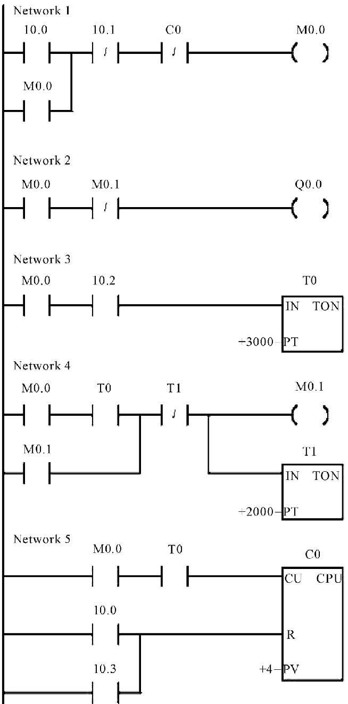

# Otázka č. 25 - Logické funkce a Booleova algebra

# Logické funkce

- matematická funkce, která přiřazuje logickou hodnotu (obvykle pravda (T) nebo nepravda (F)) každé kombinaci logických hodnot vstupních proměnných.

- Uplně a neúplně zadaná logická funkce

    - Úplně zadaná logická funkce obsahuje definici pro každou možnou kombinaci vstupů.
    - Neúplně zadaná logická funkce může obsahovat definice pouze pro část možných kombinací vstupů. V tomto případě se předpokládá, že nezadané kombinace mají neurčitý stav.

- **Neurčitý stav** 
    - Neurčitý stav (označovaný jako NULL) se vyskytuje v tří hodnotové logice, kde kromě pravdy (T) a nepravdy (F) existuje také možnost, že výsledek je neznámý.

- **Logická proměná** 
    - Neurčitý stav (označovaný jako NULL) se vyskytuje v tří hodnotové logice, kde kromě pravdy (T) a nepravdy (F) existuje také možnost, že výsledek je neznámý.
- **Dvouhodnotová (T/F) a tří hodnotová logika (T/F/NULL)**
    - Dvouhodnotová logika pracuje pouze s pravdou (T) a nepravdou (F), zatímco tří hodnotová logika umožňuje navíc neurčitý stav (NULL).

- **Logické konstanty T/F/NULL**
    - Jsou to symboly reprezentující konstantní hodnoty pravdy (T), nepravdy (F) nebo neurčitého stavu (NULL)

# Booleova algebra

- pracuje s logickými proměnnými, které mohou nabývat dvou hodnot: pravda (1) a nepravda (0).
- Základními operacemi v Booleově algebře jsou:

    1. Konjunkce (AND)
    2. Disjunkce (OR)
    3. Negace (NOT)

- Tyto operace jsou definovány pomocí logických výrazů a pravdivostních tabulek. Booleova algebra tímto umožňuje zjednodušování.

## Triviální Booleova Algebra

- vyskytuje v případě, kdy máme pouze jednu logickou proměnnou. V tomto případě jsou všechny základní logické operace triviální, protože existují pouze dvě možné hodnoty této proměnné (pravda a nepravda). 

1.	Konjunkce (AND): Záleží na hodnotách obou proměnných. 
    - 0 AND 0 = 0
    - 0 AND 1 = 0
    - 1 AND 0 = 0
    - 1 AND 1 = 1
2.	Disjunkce (OR): Záleží na hodnotách obou proměnných. 
    - 0 OR 0 = 0
    - 0 OR 1 = 1
    - 1 OR 0 = 1
    - 1 OR 1 = 1
3.	Negace (NOT): Jednoduché invertování hodnoty proměnné. 
    - NOT 0 = 1
    - NOT 1 = 0

## Minimalizace logických funkcí pomocí Booleovy algebry

- Minimalizace logických funkcí se používá k redukci počtu hradel v logickém obvodu, což snižuje náklady na výrobu a zlepšuje rychlost a spolehlivost obvodu.

- Minimalizace logických funkcí se provádí pomocí různých metod, jako je Karnaughova mapa, Quine-McCluskeyho metoda atd. Tyto metody identifikují redundantní nebo zbytečné části logické funkce a minimalizují je.

# Tabulky základních logických funkcí

## NOT(inventor)

| A | ¬A |
|---|----|
|0  |  1 |
|1  |  0 |

## AND(konjunkce)

| A | B | A ∧ B |
|---|---|-------|
| 0 | 0 |   0   |
| 0 | 1 |   0   |
| 1 | 0 |   0   |
| 1 | 1 |   1   |

## OR(disjunkce)

| A | B | A ∨ B |
|---|---|-------|
| 0 | 0 |   0   |
| 0 | 1 |   1   |
| 1 | 0 |   1   |
| 1 | 1 |   1   |

## XOR(exkluzivní disjunkce)

| A | B | A ⊕ B |
|---|---|-------|
| 0 | 0 |   0   |
| 0 | 1 |   1   |
| 1 | 0 |   1   |
| 1 | 1 |   0   |

## NAND

| A | B | A ↓ B |
|---|---|-------|
| 0 | 0 |   1   |
| 0 | 1 |   1   |
| 1 | 0 |   1   |
| 1 | 1 |   0   |

## NOR

| A | B | A ↑ B |
|---|---|-------|
| 0 | 0 |   1   |
| 0 | 1 |   0   |
| 1 | 0 |   0   |
| 1 | 1 |   0   |

## XNOR

| A | B | A ⇔ B |
|---|---|-------|
| 0 | 0 |   1   |
| 0 | 1 |   0   |
| 1 | 0 |   0   |
| 1 | 1 |   1   |

# Tabulky logických funkcí pro 3 hodnoty

## NOT (inventor)
| A | ¬A |
|---|----|
| 0 |  1 |
| 1 |  0 |
|null|null|

## AND (konjunkce)

| A | B | A ∧ B |
|---|---|-------|
| 0 | 0 |   0   |
| 0 | 1 |   0   |
| 1 | 0 |   0   |
| 1 | 1 |   1   |
| 0 |null|  0   |
|1  |null|null  |
|null|0   |  0   |
|null|1   |null  |
|null|null|null  |

## OR (disjunkce)

| A | B | A ∨ B |
|---|---|-------|
| 0 | 0 |   0   |
| 0 | 1 |   1   |
| 1 | 0 |   1   |
| 1 | 1 |   1   |
| 0 |null| null | 
|1  |null|  1   |
|null|0   | null|
|null|1   |  1  |
|null|null|null |  

## XOR(exkluzivní disjunkce)

| A | B | A ⊕ B |
|---|---|-------|
| 0 | 0 |   0   |
| 0 | 1 |   1   |
| 1 | 0 |   1   |
| 1 | 1 |   0   |
|0  |null|null  |
|1  |null|null  |
|null|0   |null |
|null|1   |null |
|null|null|null |

## NAND

| A | B | A ↓ B |
|---|---|-------|
| 0 | 0 |   1   |
| 0 | 1 |   1   |
| 1 | 0 |   1   |
| 1 | 1 |   0   |
|0  |null| 1    |
|1  |null|null  |
|null|0   | 1   |
|null|1   |null |
|null|null|null |

## NOR

| A | B | A ↑ B |
|---|---|-------|
| 0 | 0 |   1   |
| 0 | 1 |   0   |
| 1 | 0 |   0   |
| 1 | 1 |   0   |
|0  |null|null  |
|1  |null| 0    |
|null|0  | null |
|null|1  | 0    |
|null|null|null |

## XNOR

| A | B | A ⇔ B |
|---|---|-------|
| 0 | 0 |   1   |
| 0 | 1 |   0   |
| 1 | 0 |   0   |
| 1 | 1 |   1   |
|0  |null|null  |
|1  |null|null  |
|null|0   |null |
|null|1   |null |
|null|null|null |

# Karnoughova mapa a žebříčkový diagram

- Karnaughova mapa je grafický nástroj používaný pro minimalizaci logických funkcí v digitální logice. Je to tabulka s rozmístěnými buňkami, kde každá buňka odpovídá jednomu možnému vstupnímu kombinaci proměnných.

- Pro lepší pochopení principu Karnaughovy mapy, vezměme si příklad tři proměnné logické funkce. Mějme funkci F (A, B, C), kde A, B a C jsou proměnné (buď 0 nebo 1), které ovlivňují hodnotu funkce F.

- Uvažujme funkci F (A, B, C) = A'BC + AB'C + ABC'
- Prostřednictvím Karnaughovy mapy můžeme vizualizovat vztahy mezi jednotlivými vstupy a výstupem této funkce.

## Karnoughova mapa pro tři proměnné(A, B, C)

|   | 00 | 01 | 11 | 10 |
|---|----|----|----|----|
|00 |    |    |    |    |
|01 |    |    |    |    |

- V tomto případě jsou možné kombinace hodnot proměnných A, B a C rozděleny do čtyř buněk. Hodnoty v buňkách budou představovat hodnoty funkce F pro dané kombinace vstupů.

- Pro náš příklad můžeme zjistit hodnoty funkce F pro různé kombinace proměnných A, B a C a vyplnit je do Karnaughovy mapy.

- F (A, B, C) = A'BC + AB'C + ABC'

|   | 00 | 01 | 11 | 10 |
|---|----|----|----|----|
|00 |  1 |  0 |  1 |  0 |
|01 |  1 |  0 |  1 |  0 |

[VYSVĚTLENÍ](https://www.youtube.com/watch?v=N8E9psq2Ieo&ab_channel=Tom%C3%A1%C5%A1%C5%A0ustek)

## Minimalizace funkce pomocí Karnaughovy mapy

- Když máme vyplněnou Karnaughovu mapu, můžeme minimalizovat logickou funkci identifikací skupin sousedních buněk obsahujících jedničky. Tyto skupiny se mohou skládat z jednoho, dvou, čtyř nebo osmi sousedních buněk.

- V našem případě můžeme identifikovat dvě skupiny:
    1. Skupina jedniček v buňkách (0,0), (0,1), (0,3), (1,0), (1,2), (1,3), (3,0) a (3,2), což odpovídá termu A'B.
    2. Skupina jedniček v buňkách (1,1), (1,2), (1,3), (3,1) a (3,3), což odpovídá termu BC'. 

- Minimalizovaná forma funkce F je tedy F (A, B, C) = A'B + BC'.

- Tímto způsobem nám Karnaughova mapa umožňuje snadno identifikovat a minimalizovat logické funkce s několika vstupními proměnnými.

## Žebříčkový diagram

- Žebříčkový diagram je grafický nástroj používaný pro uspořádání logických hradel za sebou pro nákres složitějších logických obvodů. Tento diagram nám umožňuje vizualizovat, jak jsou jednotlivá logická hradla propojena a jakým způsobem jsou v obvodu uspořádána.

- Pro vytvoření žebříčkového diagramu logického obvodu musíme nejprve identifikovat jednotlivá logická hradla a jejich vztahy. Poté je uspořádáme do hierarchické struktury, kde každé hradlo je propojeno s předchozím a následujícím hradlem v obvodu.
- **Řazení hradel za sebe pro nákres logického obvodu**
    - Žebříčkový diagram je grafické znázornění složitější logické funkce nebo obvodu. Používá se k uspořádání hradel a jejich vzájemných vztahů.

