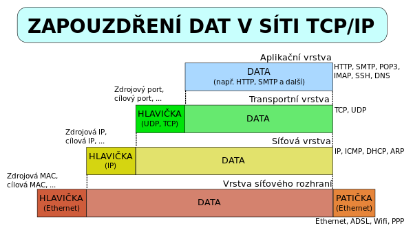

# Otázka č. 5 - ISO/OSI

> Funkce jednotlivých vrstev, porovnání modelů, popis protokolů, služeb, princip zapouzdřování – změna PDU

>1) popis modelu a jeho význam
>2) stručné porovnání s TCP/IP
>3) jednotlivé vrstvy ISO/OSI modelu - význam a funkce, příklady protokolů dané vrstvy, adresy…
>4) enkapsulace a PDU

## Význam

Model určený pro příkladovou komunikaci mezi zařízeními sítě, v praxi se moc nevyužívá.

Je rozdělen na 7 vrstev.

## Vrstvy
| Vrstva         | PDU              |
|----------------|------------------|
| 7. Aplikační   | Data             |
| 6. Prezentační | Data             |
| 5. Relační     | Data             |
| 4. Transportní | Datagram/Segment |
| 3. Síťová      | Packet           |
| 2. Linková     | Rámce            |
| 1. Fyzická     | Bity             |

*pdu = protokolová datová jednotka - balíček dat na určité vrstvě* 

### 1. Fyzická

> Bity

Vrstva popisující elektrické nebo optické signály a způsob komunikace po fyzické infrastuktuře.
Modulace a konverze signálů.

zařízení pracující na této vrstvě:
- Hub
  - Pouze kopíruje signál na všechny porty
- Repeater
- Kabely
  

### 2. Linková

> Rámce

> MAC adresa

Vrstva zodpovědná za směřování v lokální síti. Data z fyzické vrstvy jsou uspořádána do rámce, který obsahuje MAC adresy odesílatele a příjemce.

Zařízení pracující na této vrstvě:

- Switch
  - Ukládá MAC adresy do tabulky
  - Přeposílá pakety pouze na porty, kde je cílová MAC adresa

Je rozdělna do dvou podvrstvev:

#### LLC
 
Tato podvrstva zajišťuje spolehlivost přenosu dat. 

#### MAC

Tato podvrtsva zajišťuje fyzické adresování a přístup k médiu.

Při používaní halfduplex (pouze jedna starna může po médiu vysílat) se využívají metody:
  - CSMA/CD - posílá data a poslouchá, zda někdo jiný nevysílá. Pokud ano nebo dojde ke kolizi, počká a znovu to zkusí.
  - CSMA/CA - pomalejší, ale spolehlivější metoda, která se používá u bezdrátových sítí. Předchází kolizím.

### 3. Síťová

> Packet

> IP adresa

Vrstva zajišťující směrování paketů mezi různými sítěmi. Využívá se k tomu IP adresa.

Zařízení pracující na této vrstvě:
- Router

### 4. Transportní

> Datagram/Segment

> Porty

Vrstva zajišťující spolehlivý přenos dat mezi koncovými body. Využivá k tomu dvojici protokolů TCP/UDP.

Zařízení pracující na této vrstvě:
- Firewall
- Load balancer
- Proxy

Tcp 
  - spolehlivější ale pomalejší
  - Využívá checksum a potvrzování přijetí dat
  - zajišťuje i správné pořadí packetů a segmentaci

Udp
    - rychlejší ale méně spolehlivý
    - nezajišťuje správné pořadí packetů ani jejich doručení

### 5. Relační

Vrstva zajišťující komunikaci mezi aplikacemi. Přesněji jejich spojení a synchronizaci.

### 6. Prezentační
 
Vrstva zajišťující převod dat do formátu, který je srozumitelný pro příjemce.

### 7. Aplikační

Vrstva zajišťující správné předání a zobrazení dat aplikacím.

## Porovnání s TCP/IP

ISO/OSI je teoretický model, který se v praxi moc nepoužívá. TCP/IP je naopak praktický model, který se používá v praxi.
Mají i rozdílný počet vrstvev

## Zapouzdření (enkapsulace)

Je postupné prochází dat těmito vrstvami, kde se k datům přidávají hlavičky a patičky, které obsahují informace o vrstvě, ze které data pochází.

