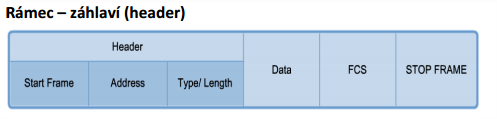
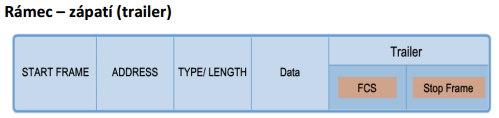

# Otázka č. 7 - Linková vrstva

> Význam vrstvy, přenos dat – PDU, význam podvrstev MAC a LLC, služby, metody přístupu k médiu

>1) vrstvy ISO/OSI modelu - pouze seřazeně vypsat :)
>2) význam vrstvy a její úkoly, PDU - popiš části, které údaje tam najdeme a jaký mají význam?
>3) podvrstvy MAC a LLC - stručně popiš
>4) které zařízení pracuje na této vrstvě? - stručně ho popiš, s jakou adresou pracuje? popiš ji :)
>5) přístupové metody - k čemu jsou? rozdělení a zástupci - popiš je…, jak s tím souvisí duplex?

# 1. Význam

- Druhá vrstva ISO/OSI modelu
- Zajišťuje komunikaci v rámci lokální sítě
- Zajišťuje přenos dat mezi dvěma nebo více uzly

## funkce

- přidává do datového rámce hlavičku a patičku (cílovou a zdrojovou adresu)
- kontroluje adresu a kontrolní součet  
- chybné rámce jsou zahozeny nebo zajištěje opakování přenosu
- Seřazuje přijaté rámce a zajišťuje jejich demultiplexování 

# 2. Přenos dat

- PDU obsahuje
    1. Data (ze síťové vrstvy)
    2. Hlavičku (řídící informace)
    3. Patičku (kontrolní informace)

## Hlavička

1. Start frame – označuje začátek rámce (speciální kombinace 0 a 1)
2. Fyzické MAC adresy příjemce a odesilatele
3. Priorita (QoS) – může označovat druh komunikace (data, hlasová)
4. Type – identifikuje jaký protokol vyšší vrstvy je obsažen v rámci
5. Flow control – slouží k řízení toku dat médiem (zastavení/povolení)
6. ongestion control – indikuje zahlcení média

## Patička

- Kontrolní součet, který umožňuje zjistit, zda při přenosu rámce nedošlo k chybě
- Odesílatel vypočítá kontrolní součet CRC a ten uloží do hodnoty FCS
- Příjemce vypočítá také CRC a pokud souhlasí s přijatým je zpráva považována za správně přenesou
- Pokud CRC nesouhlasí, rámec je zahozen a protokol linkové vrstvy může rozhodnout, zda má být chyba korigována

# 3. MAC a LLC

## MAC

- Nižší, hardwarově závislá podvrstva 
- Zavádí adresaci rámců (MAC adresa - **FF:FF:FF:FF:FF:FF**)
- Poskytuje fyzickou adresaci rámce a vymezuje data (označuje začátek a konec dat)
- Zajišťuje
    1. Fyzické adresování
    2. Řízení přístupu k médiu
- Shromažďuje data z vyšší vrstvy podvrstvy LLC (zapouzdření do MAC rámce)

## LLC

- Vyšší, hardwarově nezávislá podvrstva 
- Ovladače síťové karty
- Identifikuje v rámci, který protokol síťové vrstvy bude pro tento rámec použit
- Řízení datového toku
- Zajišťuje
    1. Multiplexování protokolů předávaných MAC vrstvě (při vysílání) a demultiplexování (při příjmu)
    2. Řízení toku dat
    3. Zabezpečení proti chybám
    4. Připojení k vyšším vrstvám
    5. Zapouzdření paketů ze síťové vrstvy do rámců
    6. Identifikaci protokolu síťové vrstvy

### Řízení toku dat

- pomocí zpětné vazby ARQ (Automatic Repeat reQuest)

- Metody
    1. **Jednotlivé potvrzení (Stop&Wait)**
         - paket je kontrolován a doručován ve správném pořadí
    2. **Kontinuální potvrzení s návratem (Go-Back-N)** 
        - Odesílá všechny rámce
        - Odpovědi dostává zpětně
        - Reaguje až po odeslání
        - Pokud ztratí rámec, pošle vše znova
    3. **Kontinuální potvrzování se selektivním opakováním (Selective Repeat)**
        - Data se odesílají bez čekání na potvrzení 
        - Příjemce informuje Odesílatele, které rámce chybí -> Příjemce ho pošle znova

# 4. Přístupové metody

## Ke sdílenému médiu

- Sdíleno více uzly
- V jedné chvíli může být více uzlů pokoušející se vysílat a přijímat data prostřednictvím média
- Metody
    1. Řízený přístup (deterministická) 
        - každý uzel má svůj čas přístupu k médiu
    2. Konkurenční přístup (nedeterministická)
        - všechny uzle soutěží o použití média
## Ke nesdílenému médiu

- Není třeba řízení přístupu
- Nastává v případě topologie point-to-point 

## Half-duplex

- Obě zařízení mohou vysílat i příjimat ale ne ve stejnou chvili
- Ethernet má přístupové metody (CSMA/CD) pro řešení konfliktů, vyplývajících z pokusů více než jedné stanice vysílat ve stejný čas

## Full-duplex

- Obě zařízení mohou zároveň vysílat a přijímat data
- Není nutné žádné vyjednávání o médiu
- Při zapnutí full duplexu se vynutí vypnutí přístupové metody (CSMA/CD) na síťové kartě