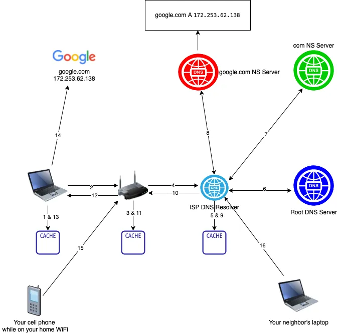

# Otázka č. 10 - Aplikační vrstva

> Význam vrstvy – pohled ISO/OSI, TCP/IP, popis protokolů 

>1) vrstvy ISO/OSI modelu - pouze seřazeně vypsat :)
>2) porovnání z pohledu TCP/IP a ISO/OSI
>3) popis vrstev ISO/OSI modelu odpovídajících aplikační vrstvě TCP/IP - o co se starají?
>4) popiš protokoly - FTP, HTTP a HTTPS, emailové protokoly (rozdíl), DNS, DHCP (druhy, princip

Jedná se o sedmou vrstvu modelu ISO/OSI a čtvrtou vrstvu modelu TCP/IP. představuje rozhraní díky kterému můžou uživatelé nebo aplikace komunikovat.
Tato vrstva je nejblíže uživateli.

Příklady funkcí:

- Přenos souborů - FTP
- E-mail - SMTP, POP3, IMAP
- WWW - HTTP, HTTPS
- Remote login - Telnet
- Remote file access - NFS 

## Email

trojice protokolů 

- SMTP - Odesílání emailů (465)
- POP - emaily jsou ze serveru stahovány, na serveru se pak vymažou (995)
- IMAP - emaily jsou na serveru, klient si je pouze zobrazuje (993)

## DHCP

funguje zde tvz. dhcp handshake

- 1 - DHCP Discover - vysílá klient (nalezení serveru)
- 2 - DHCP Offer - vysílá server (nabídka adresy)
- 3 - DHCP Request - vysílá počítač (žádost o adresu)
- 4 - DHCP Ack - (potvrzení že je adresa registrována klientovi)

### HTTP
existuje několik metod při použivání http požadavků

GET - získání kodu stránky, posílá se ve formě textu
POST - používá se pro posílání dat např z formulářů

HEAD, PUT, DELETE - moc se nepoužívájí 

## NTP
protokol pro synchornizaci času napříč sítí

## DNS
Protokol používaný pro překlad doménový jmen na ip adresy

používá se tvz. stromová struktura kdy existují TLD 

> TLD - Top Level Domain - doména nejvyššího řádu (.cz, .eu, .com)

pod nimi jsou již SLD 
> SLD - Second Level Domain - domény které si může rezervovat člověk např spsul

a pod nimi již mohou existovat další subdomény

### princip DNS

klient vyšle request na získání ip adresy na server (kořenový server). Pokud tento server nemá záznam o této doméně, má však záznam o dalším dns serveru, kterého se může zeptat (TLD) ten pak předá informaci o dns serveru, kde se může překlad nacházet

## Aplikační protokoly
> definují typ, pravidla a syntaxi zprávy

## PULL a PUSH model

PULL -> komunikace iniciována klientem (web)
PUSH -> komunikace iniciována serverem (sdílení medií)

*Zabbix*