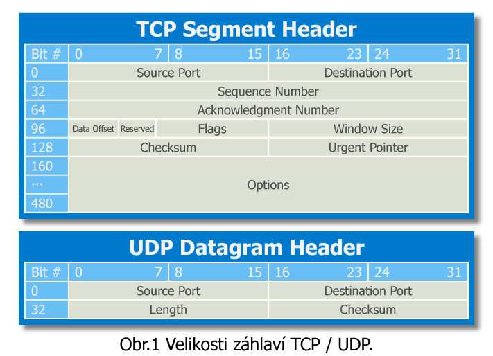

# Otázka č. 11 - TCP/UDP

> Význam protokolů, činnost TCP/UDP a jejich nasazení, porty,
navázání spojení, řízení toku, UDP

>1) stručný úvod o vrstevnatých modelech - vrstvy :)
>2) na jaké vrstvě tyto protokoly najdeme? popiš stručně tuto vrstvu
>3) popiš oba protokoly a porovnej jejich rozdíly + příklady služeb
>4) popiš princip navázání spojení a ověřování doručení - popiš třeba na obrázku?

## TCP/UDP
Tyto protokly se nachází na 4 vrstvě iso/osi modelu

Tato vrstva je zodpovědná za způsob přenosu, segmentaci dat, ověřování chyb a případné znovu poslání.

> Segmentace - rozdělení zprávy na menší dílčí části, tím se v případě chyby může poslat jen malá část

## UDP

- posílá data jen tak
- nezáleží mu na pořadí
- rychlejší
- pokud datagram nedojde, neposílá se znovu

používá se pro videohovory, videa, volání, routovací protokoly, DNS, atd..
    
## TCP

Tento protokol je používanější, 

- před zahájením každého přenosu náváže spojení s protějškem
- spolehlivost
  - umožňuje detekci chyb
  - řazení segmentů za sebou
- pomalejší
- nepodporuje multi ani broadcasr

používá se pro přenos webů, souborů, atd...

### navázání spojení

3-way handshake

1) SYN - klient vyšle požadavek na server, s požadavkem na navázání spojení. (V rámci toho posílá SYN což je číslo, kterým začínají segmenty)
2) SYN + ACK - Server odpoví stejným požadavkem a požadavkem na potvrezní předchozího dotazu
3) ACK - klient pošle zprávu s potvrzením o navázání spojení

## Porty

je to virtuální bod přes který proudí komunikace, používá se k rozdělní více služeb v zařízení. Každý port má tak přiřazenou službu, která ho využívá.

jsou spravovány operačním systémem

