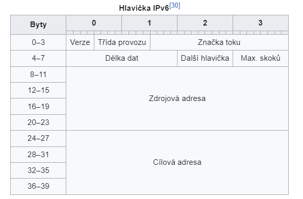

# Otázka č. 13 - IP adresace sítí - podsítě

> Význam masky,  CIDR, VLSM, podsítě - výpočet podsítí, význam IANA, IPv6 - struktura 

>1) jaký je význam IP adresy?
>2) popiš IPv4 - jak vypadá, z jakých částí se skládá, velikost, druhy…
>3) popiš IPv6 - opravdu stručně!!
>4) popiš pojmy: maska, podsíť, prefix, VLSM, IANA, CIDR
>5) návrh podsítí - vytvoř ukázkový příklad - základní síť rozděl alespoň na 3 podsítě a spočítej
   užitečné informace (adresa podsítě, maska, broadcast, rozsah, reálný počet adres…)

## Význam masky

- Je číslo, které popisuje rozdělení počítačové sítě do podsítí (subnets)
- Maska sítě zapsaná v binárním tvaru má zleva samé jedničky až do místa, kde končí místo sítě a na místě části pro síťové rozhraní jsou samé nuly
- Pomocí masky router rozhoduje i o směrování IP datagramů

## CIDR

- Beztřídní směrování
- Umožňuje nastavit vlastní masku (přizpůsobení počtu adres v síti)
- Zabraňuje mrhání IP adres, stanoví se vždy požadovaná velikost
- Snížilo to velikost směrovacích tabulek

## VLSM

-  Standardní subnetting používá stejnou délku masky (prefixu) pro všechna podsítě v rámci dané sítě. 
- Můžete efektivněji alokovat IP adresy tak, aby lépe odpovídaly potřebám vaší sítě. 
- Rozdělení sítě na menší 
- Lépe využit adresní prostor
- Umožňuje to vytvořit síťovou hierarchii 

## Podsítě

- Samostatná část počítačové sítě
- Podsítí je většinou míněna menší vyčleněná část větší IP sítě
- Pro určení rozsahu IP adres v dané podsítí slouží MASKA sítě
- Subnetting – rozdělení sítě na dvě nebo více menších podsítí 

- [Výpočet podsítě](http://www.superuser.cz/it/ipv4-jak-na-vypocet-podsiti-a-masky-site-cidr-subnets/)

## IANA (Internet Assigned Numbers Authority)

- Autorita pro přidělování čísel na internetu
- Je organizace, které dohlíží celosvětově na přidělování IP adres, správu kořenových zón DNS, definování typů medií pro MIME a další náležitosti internetových protokolů

## IPv6 Struktura

- Navržena, aby řešila nedostatek IP adres
- Přináší především velké rozšíření adresního prostoru 
- Dále reaguje na vzrůstající přenosové rychlosti a moderní komunikační technologie
- celkem 2^128 (zhruba 3,4×1038) adres
- 128 bitů = 16 byte
- Dostatečný adresový prostor

### Cíle

- Design odpovídajícím vysokorychlostním sítím
- Bezpečnostní mechanismy přímo v IP
- Podpora mobilních zařízení
- Kooperace s IPv4 a co nejhladší přechod ze stávajících protokolů na nový

**Verze** – verze protokolu

**Třída provozu** – Úroveň priority se dělí na rozsahy: kde zdroj podporuje kontrolu přetížení a bez podpory kontroly přetížení.

**Značka toku** – Pro správu QoS. Původně určeno pro speciální obsluhu aplikací reálného času, nyní se nepoužívá. 

**Délka dat** – délku těla paketu. Při vynulování se nastaví „jumbo“ tělo

**Další hlavička** – určuje další vnořený protokol.

**Max. Skoků** - číselně definuje počet povolených přechodů síťovými prvky. 

**Zdrojová adresa** – IPv6 adresa síťového rozhraní, které datagram vyslalo.

**Cílová adresa** – IP adresa síťového rozhraní, kterému je datagram určen.

### Anycast

- Označují jedno rozhraní připojeného počítače či protokolu
- Zasílání paketu pouze jednomu počítači

### Multicast

- Představují adresu skupiny síťových rozhraní 
- Paket se skupinovou cílovou adresou bude dopraven všem členům skupiny
- Časté využití pro videokonference atd. (šíření zvukového, či obrazového signálu)

### Unicast

- Také označují skupinu síťových rozhraní, ale datagram bude dopraven jen na jedno z nich (zpravidla to nejbližší)
- Umožňuje například realizovat některé speciální služby, klient odešle datagram s obecnou adresou a některý z dostupných serverů se jej ujme