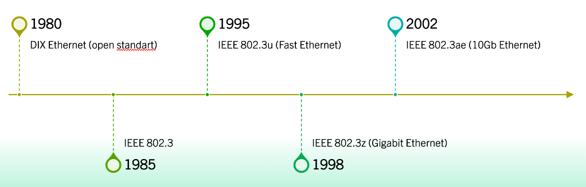
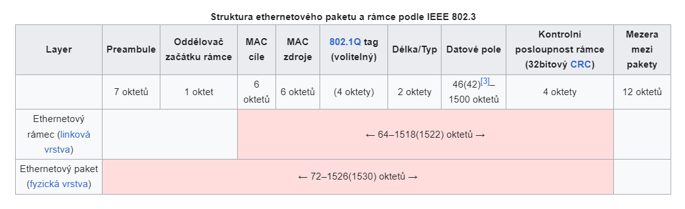
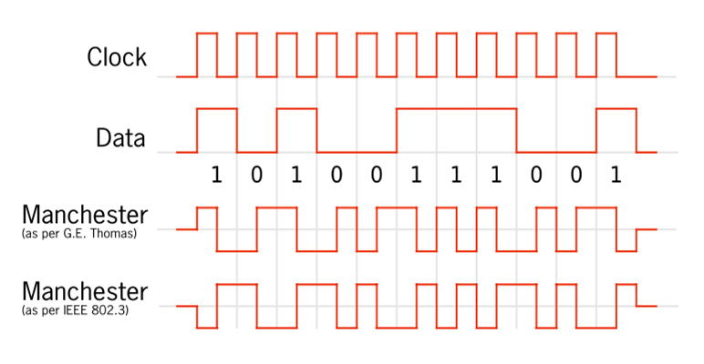

# Otázka č. 14 - Ethernet - historie

> Vznik, klasický Ethernet, DIX, IEEE rámce Ethernetu, přístupová metoda, kódování, časování, vztah k ISO/OSI 

>1) Co je to Ethernet?
>2) Vývoj Ethernetu - použij pojmy jako DIX, IEEE… můžeš například i popsat vývoj technologií
   spojených s Ethernetem… například rychlosti přenosu atd… :)
>3) Ethernetový rámec - stručně popiš, co v něm tak najdeme? Jak souvisí s ISO/OSI?
>4) Jaká přístupová metoda je použita pro Ethernet? - K čemu to je a jak to funguje?
>5) Kódování Manchester - velice jednoduše vysvětli

- Název souhrnu technologií pro počítačové sítě (LAN, MAN), které používají kabely s kroucenou dvoulinkou, optické kabely (dříve i koaxiální kabely)

## Vznik

- Vyvinut v roce 1972 - 1975
- První verze Ethernetu používaly pro šíření signálu koaxiální kabel, ke kterému mohlo být připojeno až několik desítek počítačů.
- Experimentální verze sítě ethernetu pracovala s přenosovou rychlostí přibližně 3 Mbit/s​

### Ethernet I (DIX)

- první komerční verze byla v roce 1980, kdy byla přenosová rychlost zvýšena na 10 Mbit/s
- Vyvinut firmami DEC, Intel a Xerox 
- standardizován v roce 1982 sdružením ECMA (European Computer Manufacturers Association)

### Ethernet II (DIX-Ethernet)

- Po vytvoření standartu IEEE 802.3 byl DIX upraven, aby dosáhl lepší kompatibility se standardem IEEE, čímž vznikl Ethernet II
- Již se nerozvýjí a spadá pod IEEE 802.3

## Klasický Ethernet

-  typ počítačové sítě, který využívá kabelovou infrastrukturu pro přenos dat mezi zařízeními. Tento typ sítě využívá metodu přístupu k médiu CSMA/CD
- Pracuje s rychlostmi 10 Mbps, 100 Mbps, 1 Gbps nebo vyššími. Kabelová infrastruktura může být různá, ale často se používá kroucená dvojlinka (Twisted Pair) pro kratší vzdálenosti a optický kabel pro delší propojení.
- Několik variant, jako je například 10BASE-T (10 Mbps Ethernet přes kroucenou dvojlinku), 100BASE-TX (100 Mbps Ethernet přes kroucenou dvojlinku), a 1000BASE-SX (1 Gbps Ethernet přes optický kabel), mezi mnoha dalšími. 

## IEEE rámce Ethernetu

- Je protokolová datová jednotka linkové vrstvy v síti Ethernet
- Na fyzické vrstvě mu předchází preambule a oddělovač začátku (SFD), které s ethernetovým rámcem tvoří paket

### Preambule

- Umožňují zařízením na síti snadno rozpoznat začátek přicházejícího rámce.

### Hlavička 
- Obsahuje zdrojovou a cílovou adresu, pole Délka/Typ a volitelně IEEE 802.1Q tag
- Pole Délka/Typ může být použito dvěma způsoby
    - odnoty 1500 a menší znamenají, že se jedná o délku pole v oktetech
    - Hodnoty 1536 a větší znamenají, že se jedná o EtherType – identifikuje jaký protokol je zapouzdřený v datovém poli rámce
- Nepovinný IEEE 802.1Q tag indikuje příslušnost k VLAN a prioritu podle IEEE 802.1p

### Datové pole

- Přenos dat vyšším vrstvám.
- Minimální délka je 46 oktetů (je-li přítomný 802.1tag, stačí 42 oktetů)

### Kontrolní posloupnost rámce

- slouží k detekci chyb v rámci

### Mezera mezi packety 

- Je časový interval mezi pakety, po který nesmí žádná stanice vysílat
- Po odeslání paketu se vysílač musí odmlčet minimálně na dobou potřebnou pro přenos 96 bitů (12 oktetů) před přenosem dalšího paketu

## Přístupová metoda

- Reguluje přístup jednotlivých uzlů ke sdílenému přenosovému médiu
- Metoda CSMA, monitoruje jednotlivé stanice, zda právě neprobíhá nějaké vysílání – aby se nerušili navzájem
- Na společném přenosovém médiu může vysílat vždy jen jedna stanice
- Sekají-li se na médiu signály z více stanic, vznikne kolize a signál je znehodnocen
- Monitorováním provozu lze dosáhnout vyšší efektivity sítě
- Dojde-li ke kolizi, musí být zajištěno, že ji zaznamenají všechny uzly v doméně

### CSMA

- Stanice připravená posílat data si „poslechne“ zda je přenosové médium (kabel) nepoužívá jiná stanice
- Pokud je přenosové médium zabrané, stanice zkouší přístup později, až do doby, dokud není médium volné
- V okamžiku uvolnění média začne stanice vysílat data

### CD

- Stanice během vysílání sleduje, zda je na médiu signál odpovídající vysílaným úrovním (tedy aby se např. v okamžiku kdy se vysílá signál 0 nevyskytl signál 1)
- Případ, kdy dojde k interakci signálů se nazývá kolize
- V případě detekce kolize, stanice generuje signál JAM a obě (všechny) stanice, které v daném okamžiku vysílaly generují náhodnou hodnotu času, po níž se pokusí vysílán zopakovat

## Kódování

- Kódování Manchester je způsob zakódování dat, který se využívá pro přenos dat počítačovou sítí na fyzické vrstvě ISO/OSI modelu, např. v Ethernetu nebo Token Ringu
- V případě synchronního přenosu dat mezi odesílatelem a příjemcem je nutný synchronizační signál
- Manchesterský kód spojuje původní datový signál se synchronizačním signálem, a tedy umožňuje synchronní komunikaci
- Využívá se hrana – změna signálu, pokud signál přechází z vysoké úrovně na nízkou úroveň, pak vyjadřuje hrana hodnotu bitu 1. V opačném případě (nízká -> vysoká), hodnota bude 0
- Zakódoval bity, když přecházel z vysoké na nízkou a nízké na vysokou

## Časování

### CSMA/CD

- Pokud dojde k detekci kolize, časování hraje roli při následné retransmisi dat po náhodném časovém intervalu.​

### Slot Time 

- Je specifický časový interval, během kterého mohou zařízení v síti detekovat kolize.​

### Frame Time

-  Určuje maximální dobu, po kterou může trvat odeslání jednoho rámce v síti. Ovlivňuje to, jak rychle může zařízení odeslat své data.

### Interframe Space

- Je doba, kterou musí zařízení počkat po odeslání jednoho rámce předtím, než začnou odesílat další.

### Time Division Duplex

- Přiděluje specifické časové intervaly pro přenos dat a příjem dat, což umožňuje efektivní využití bezdrátového média.​

## Vztah k ISO/OSI

- pracuje na fyzické a linkové vrstvě ISO/OSI modelu