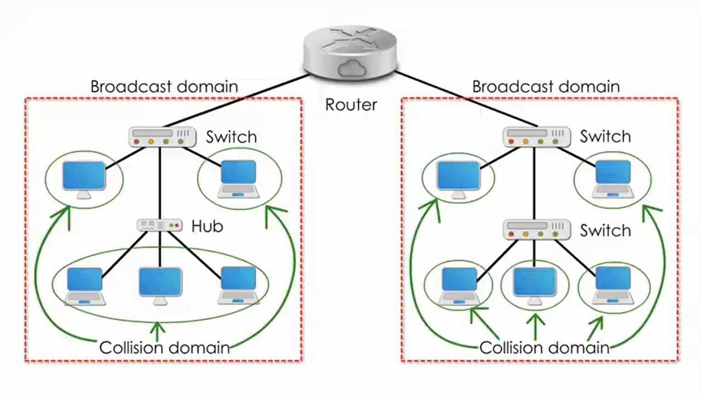

# Otázka č. 15 - Ethernet

> přepínaný Ethernet, důvody vzniku, kolizní doména, broadcast, aktivní prvky Ethernetu, budoucnost Ethernetu

>1) Co je to Ethernet? Jak bys ho popsal?
>2) Co je to kolizní doména? Vysvětli klidně na obrázku. Popiš, jak aktivní prvky ovlivňují tuto
   kolizní doménu. Jak s tím souvisí Duplex?
>3) Co je to broadcastová doména? Opět klidně vysvětli na obrázku. Co je to broadcast?
>4) Kterou přístupovou metodu využívá Ethernet? Trochu ji popiš. K čemu tyto přístupové metody
   obecně jsou?

Ethernet je jedna z nejběžnějších technologií pro lokální počítačové sítě

## 1. Historie a důvody vzniku

- vyvinut v Xerox PARC, 70. letech 20. století
- snadné propojení periferií a počítačů v rámci organizace
- Standardizován jako IEEE 802.3 

## 2. Přepínaný Ethernet

- Rychlá a efektivní komunikace mezi zařízeními
- Umožňuje směřování datových rámců na základě jejich MAC adresy
- Umožnil segmentaci sítě na menší jednotky a tím zvýšil efektivitu a propustnost
- Provozovaní více switchnu paralalně, což umožňuje přepínaní provozu na záložní cestu v případě výpadku
- Plný duplex provoz 

## 3. Kolizní doména

- Oblast nebo segment sítě, ve ktérem může docházet ke kolizím, když více zařízení v sítí součastně odesílá data
- Pokud dojde ke kolizi, zařízení v síti jsou informována a musí počkat náhodně určenou dobu, než zkusí odeslat data znova
- Náhodná doba měla za cíl minimalizovat pravěpodobnost kolize
- Každý port na switchi je samostatná kolizní doména, což znamená že kolize jsou omezeny na jednotlivé zařízení připojená k switchi

## 4. Broadcast a Broadcastová doména

### Broadcast

- Speciální druh síťového rámce, který je doručen všem zařízením v síti
- Broadcastové rámce mají hodnotu MAC adresy **FF:FF:FF:FF:FF:FF**
- Slouží k nalezení jiných zařízení v síti, k inicializaci síťového provozu (DHCP), vyhledávaní služeb, oznamování sítě o změnách

### Broadcastová doména

- Oblast nebo segment sítě, kde jsou broadcastové rámce šířeny
- Pomahájí omezit záplavu broadcastových rámců v síti a zvyšuje efektivitu sítě

## 5. Aktivní prvky Ethernetu

### Switch
- Pracuje na linkové vrstvě ISO/OSI modelu
- Směruje rámce na základě jejich MAC adres
- Rozhoduje na jaký port bude rámec poslán
### Router
- Pracuje na síťové vrstvě ISO/OSI modelu
- Směruje data mezi různými sítěmi a podsítěmi na základě IP adresy
- Umožňuje komunikaci mezi různými sítěmi
### Hub
- Pracuje na fyzické vrstvě ISO/OSI modelu
- Posílá vstupní data na všechny výstupní porty bez ohledu na cílovou adresu
### Repeater
- Slouží k regeneraci signálu a zesilování signálu v Ethernetové síti
- Spíše se používají switche
### Bridge
- Pracuje na linkové vrstvě ISO/OSI modelu
- Propojuje dva či více segmentů sítě, tak aby se chovali jak jeden logický segment
- Izoluje síťový provoz na jednom segmentu od provozu na druhém segmentu
- Může také spojovat různé typy sítí (Ethernet, Wi-Fi)

## 6. Budoucnost Ethernetu

- klasické rychlosti (1Gbps, 10Gbps)
- Vyšší rychlosti se stávají běžnější (25Gbps,100Gbps, 400 Gbps)
- Používám ve veřejných sítích 
- Klíčová technologie pro datová centra, kvůli schopnosti podporovat vysokorychlostní přenos
- Zvýšení důraznosti na bezpečnost (šifrování, detekce hrozeb, zajištění integrity dat)
- Automatizace a řízení založené na umělé inteligenci (IBN) 