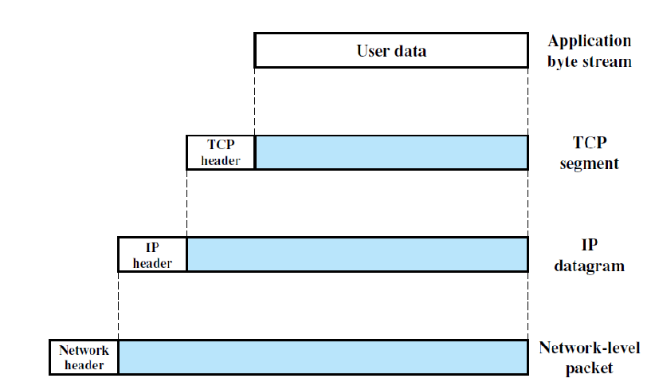
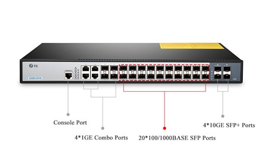
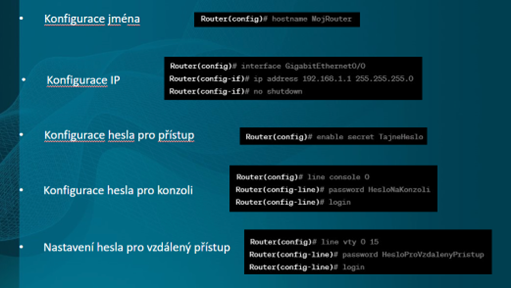
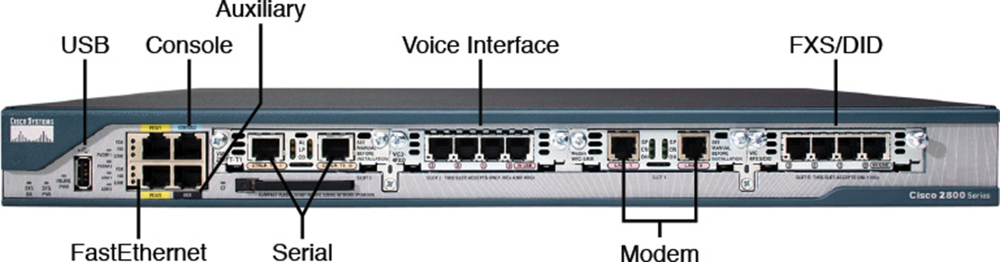

# Otázka č. 16 - Síťový HW

>   Popis zařízení, vztah ISO/OSI, PDU, konfigurace switche, routeru

>1) uveď příklady síťových zařízení a jednoduše popiš jejich funkci (aktivní a pasivní prvky)
>2) popiš router - jak ho poznám, k čemu slouží atd…
>3) popiš switch - jak ho poznám, k čemu slouží atd…
>4) popiš druhy kabelů - stručný popis, výhody a nevýhody, použití
>5) uveď pár příkladů nastavení těchto zařízení - například hostname, ip adresy, hesla…

# 1. Popis zařízení

## Hub

- Pracuje na první vrstvě (fyzické), kopíruje bity (0,1), posílá zprávy všem
- Zbytečné přetěžování segmentů, data se posílají i tam kam vůbec nejsou určená

## Switch 

- Pracuje na druhé vrstvě (linková), pracuje s MAC adresou
- Má MAC adress table, kde jsou uloženy MAC adresy počítačů
- Zprvu je tabulka prázdná, když dostane zprávu od PC, uloží si jeho MAC adresu a postupně se učí
- Odděluje síťový provoz (nezatěžuje sítě)

## Router

- Pracuje na třetí vrstvě (síťová), pracuje s IP adresou
- Připojuje síť k jiné síti, často má DHCP
- Procesem zvané routování přeposílá datagramy směrem k jejich cíli

## Gateway
- Název aktivního zařízení (síťového uzlu), které má v počítačové síti nejvyšší postavení
- Brána propojuje dvě sítě pracující s odlišnými komunikačními protokoly
- Zprostředkovává komunikace dvou odlišných typů sítě

## Bridge 
- Spojuje dva fyzicky oddělené segmenty sítě

## Repeater
- Obnovuje poškozený, zkreslený signál, který na fyzicky delším úseku sítě se poškodí, obnovený a posílený jej posílá dál

## Pasivní prvky

### Kroucená dvojlinka

- Kroucená je podle do sebe zakroucených párů vodičů (4 páry) => tím se vyruší elektromagnetické rušení
- Nižší šířka pásma (tím pádem i menší datový přenos)
- Hodně omezena vzdálenost (cca 100m – záleží na kabelu)
- Přenosová rychlost max 10 Gb/s

### Koaxiální kabel

- Tvořen dvěma vodiči s odlišnou funkcí: Vnitřní vodič pro přenos dat, vnější (obalový) vodič pro odstínění rušení vnějším elektromagnetickým polem
- Koaxiální kabel je zakončen BNC konektorem
- Dnes téměř nevyužívané, jen v některých budovách (např. panelové domy)

### Optické kabely

- Dražší
- Lepší dosah na větší vzdálenosti v řádech km
- Vysoká přenosová kapacita
- Odolnost proti rušení
- laser nebo diodové

# 2. PDU

1. Obsahuje řídící informace (například adresy) a uživatelská data
2. Ve vrstvových systémech jednotka dat definována protokolem určité vrstvy, skládá se z řídící informace a případných uživatelských dat této vrstvy (Ethernetový rámec, nebo PDU iSCS)

## Rozdělení PDU
1.	PDU vrstvy 1 (fyzické) – je fyzický paket, skládá se z bitů nebo obecněji symbolů 
2.	PDU vrstvy 2 (linkové) –  je rámec
3.	PDU vrstvy 3 (síťové) – je paket
4.	PDU vrstvy 4 (transportní) – je TCP segment nebo UDP datagram
5.	PDU vrstev 5-6-7 (aplikační) – je zpráva

# 3. Konfigurace switche

# 4. Konfigurace routeru

