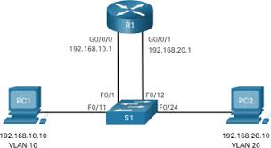
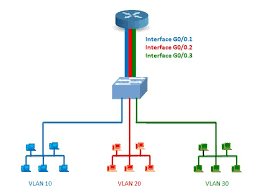

# Otázka č. 18 - Virtuální LAN

>Význam VLAN, VLAN1, konfigurace a administrace VLAN, VTP, vztah k STP, RSTP, Inter VLAN routing

>1) Co jsou to VLAN? Jaký mají praktický význam použití? Jaké druhy VLAN máme? Vrstva?
>2) Jak prakticky funguje VLAN? Zajímá mě tedy, jak zařízení pozná, do které VLAN daná zpráva
   patří; jaké druhy portu v souvislosti s VLAN máme a jaký mají význam.
>3) InterVLAN routing - co to je? Jaké 3 řešení máme? - popiš, nakresli, porovnej…
>4) Jak s VLAN souvisí Spanning Tree Protocol?

## Co je to VLAN
V podstatě jednu fyzickou síť můžeme rozdělit na několik dalších virtuálních sítí

### Jaký mají praktický význam použití
- Úspora fyzických přepínačů
  - Místo použití tří samostatných přepínačů můžeme použít jeden a rozdělit ho na tři VLANy.
- Bezpečnost:
  - VLANy izolují provoz mezi skupinami zařízení. Například můžeme oddělit zaměstnance od hostů nebo oddělit různé oddělení ve firmě.
- Optimalizace provozu
  - Rozdělení do VLAN umožňuje efektivnější správu provozu. Bude to 
  - Rychlejší, protože rovnou má jenom cesty kde ta VLAN vede
  
### Jaké druhy VLAN máme
- Defaultní – automaticky nastavena na všech portech na SW (VLAN1)
- Datová – rozdělení například firmy podle určení
- Nativní – pokud nepatří rámec do žádné VLAN tak má přiřazenou nativní, aby mohl projít skrz
  trunk (bez VLAN by neprošel) – defautně VLAN 1
- Managment – pro správce sítě – telnet, ssh
- Voice – k obsluhování IP telefonů (VoIP)

### Vrstva
- 2.vrstva (linková)

### Jak prakticky funguje VLAN
- Každý port na přepínači může být přiřazen k určité VLAN. Například porty 1-10 mohou patřit do VLAN 10, zatímco porty 11-20 mohou patřit do VLAN 20.
- Přepínač používá MAC adresy k rozhodnutí, kam směrovat rámce. Rámce v jedné VLAN jsou přeposílány pouze na porty ve stejné VLAN.

### Jak zařízení pozná, do které VLAN daná zpráva patří
Přepínač používá MAC adresy k rozhodnutí, kam směrovat rámce. Rámce v jedné VLAN jsou přeposílány pouze na porty ve stejné VLAN

### Jaké druhy portu v souvislosti s VLAN máme a jaký mají význam
- Access port: Připojení k jedné VLAN. Používá se pro koncová zařízení.
- Trunk port: Přenáší provoz z více VLAN. Používá se mezi přepínači nebo přepínačem a směrovač

## InterVLAN routing
### co to je?
- InterVLAN směrování umožňuje komunikaci mezi různými VLAN.
Jaké 3 řešení máme? 

#### Legacy Inter-VLAN Routing
- Zastaralý
- Každý fyzický port na routeru je pouze jedna VLAN
- neefektivní
- Výhoda: jednoduchost, každáý vlan má svůj fyzický port
- Nevýhoda: omezení počtu portů podle routeru, neefektivní

#### Router-on-a-Stick Inter-VLAN Routing
- Router má na jednom portu několik VLAN
- Omezení 50 VLAN
- Zahlcení 
- Výhoda: je potřeba méně portů na routeru
- Nevýhoda: může být pomalé, pokud je hodně VLAN

#### Layer 3 Switch Inter-VLAN Routing
- Funguje na switchi (zastoupení routeru)
- nejnovější a nejmodernější metoda
- Pro každou VLAN nastavit SVI(Virtual Switch Interface) na switchi

## Trunking protocol
 ### Trunking protocol
- Automatické dohodnutí na vytvoření trunku (dvou SW)
- Pouze na cisco zařízení
- Pokud není nastaveno trunk nebo acces tak přijde na řadu Dynamic trunking protocol
### Dynamic trunking protocol
- Dynamic auto – vytvoří trunk propojení pokud je o to požádán nebo na druhé straně je už nastavený trunk
- Dynamic desire – vytváří trunk a žádá ostatní o vytvoření

## Jak s VLAN souvisí Spanning Tree Protocol?
- Počítá každou cestu zvlášť pro každou VLAN (určí hlavní cestu)
- Bridge Protocol Data Unit
  - BID (Bridge ID) - id switche, který to vyslal + nese údaje o SW
  - Bridge Priority – důležitost SW (0 až 61440 a 0 je nejvyšší priorita)
  - Extended System ID – nese VLAN ID pro kterou se to počítá
  - MAC adresa – adresa Switche
  - Port ID, BPDU type, Root ID (id toho kdo je root)
- RSTP
  - Zahazuje některé výpočty a je to v podstatě zrychlený stp.
  - Rapid spanning tree protocol