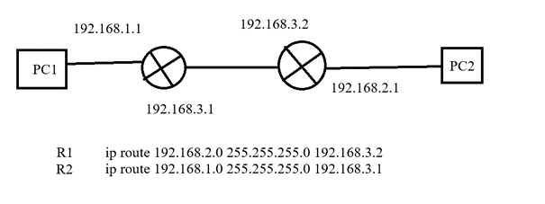
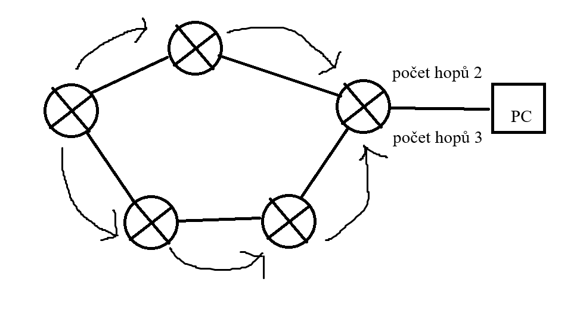
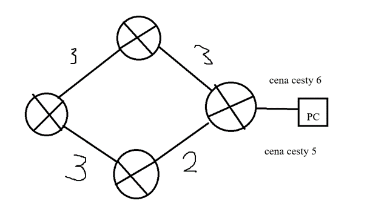
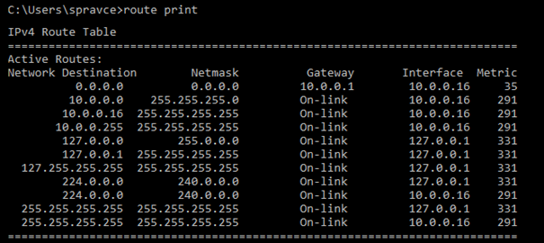
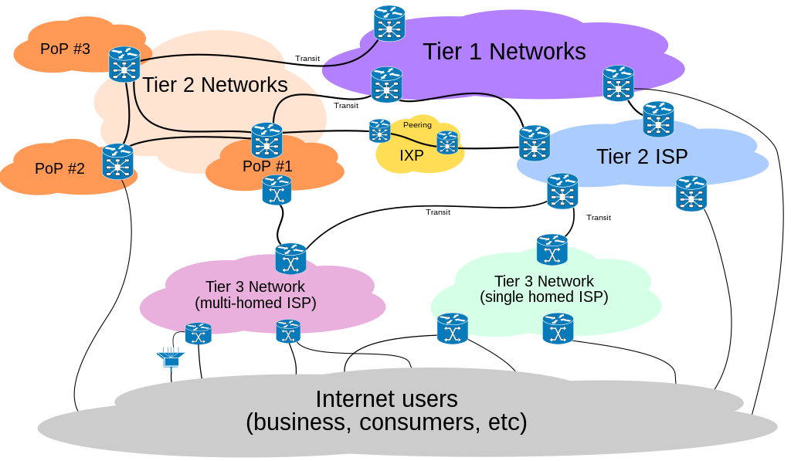
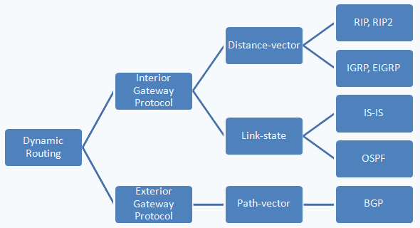
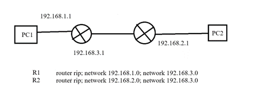

# Otázka č. 19 - Směrování v sítích IP

> Rozdělení protokolů, metody směrování - statické/dynamické, význam autonomních systémů, klasifikace směrovacích protokolů, metriky cest, směrovací protokoly 

>1) co je to směrování? - jaké zařízení, jaká vrstva? směrovací tabulka?
>2) popiš statické směrování - princip, jak se nastavuje
>3) popiš dynamické směrování - princip, dělení, zástupci a jejich stručný popis
>4) porovnej použití, výhody a nevýhody statického a dynamického směrování

Označuje určování cest datagramů v prostředí počítačových sítí  

## 1. Rozdělení protokolů

- Statické směrování 

- Dynamické směrování 

- Hybridní směrování (statické + dynamické)

- Defaultní směrování 

## 2. Metody směrování

### Statické směrování

- Směrovací tabulky jsou vytvářeny ručně na každém routeru
- Výhodné pro malé sítě
- Používano pro záložní trasy, kde je potřeba pevná a předvídatelná konfigurace
- Příklady: `ip route [CÍLOVÁ SÍŤ] [MASKA PODSÍTĚ] [NEXT-HOP] `

### Dynamické směrování

- Směrovací tabulky jsou aktualizovány automaticky na základě informací, které si routery vyměnují
- Výhodné pro velké a dynamické sítě
- Příklady:  `RIP, OSPF, BGP, EIGRP `

#### Distance-vector routing protokol (RIP,EIGRP)

- Routery udržují routovací tabulku s informací o (vektoru) vzdálenosti do dané sítě
- Periodicky routovací tabulku zasílají sousedům, ti si upravují svoji tabulku a tu opět odešlou dále.
- Pro výpočet nejlepší cesty se používá počet hopů nebo propustnost linky a zpoždění 

#### Link-state routing protokol (OSPF, IS-IS)

- Udržuje si kompletní a aktuální mapu celé topologie v síti (LSA)
- LSA jsou vyvolány událostí v síti a do svého okolí posílá hello packety, kde zásílá informace 
- Používá Dijkstrův algoritmus pro vypočítaní nejkratší cestu k cíli

#### Směrovací tabulka

## 3. Autonomní systémy

- Samostatná síť nebo skupina sítí s jednotnou směrovací politikou 
- Jedinečné číslo 
- Interní a externí směrování 
- BGP (Border Gateway Protocol)  
- Příkady: `školní síť, domácí síť`
- Hierarchie směrování 
    - Existuje několik tříd autonomních systémů

    1. Globalní internetoví giganti (Tier-1 ISPs)
    2. Regionální či národní poskytovatelé (Tier-2 ISPs)
    3. Menší regionální nebo specializovaní poskytovalelé (Tier-3 ISPs)

    

## 4. Klasifikace směrovacích protokolů

- Podle způsobu směrování
    - Vektorové směrovací protokoly (RIP)
        - určuje směr podle vektoru nebo směrovací tabulky
    - Směrovací protokoly stavu spojení (OSPF)
        - Udržuje stav sítě a rozhoduje na základě informací o topologii sítě
- Podle oblasti použítí
    - Interní směrovací protokoly (OSPF, IGRP, RIP, EIGRP, IS-IS)
        - Používány v rámci jednoho autonomního systému
    - Externí směrovací protokoly (BGP, IGP, ISIS)
        - Používány pro směrování mezi autonomními systémy
- Podle druhu směrovací metriky
    - Metrika založená na počtu skoků (RIP)
        - Určuje směr na základě počtů skoků od zdroje k cíli
    - Metrika založená na propustnosti 
        - používá metriku založenou na propustnosti spojení nebo jiných kvalitativních faktorech.

    

## 5. Metriky cest

- Číselné vyjádření kvality, ceny cesty
- Pokud je více cest do jedné cílové sítě, vybírá se cesta s nejmenší metrikou – nejlevnější cesta

1. Metrika založená na počtu skoků (RIP)
    - Určuje kvalitu cestu na základě počtu routerů, které musí paket projít k dosažení cíle
2. Metrika založená na propustnosti (IGRP, EIGRP)
    - Používá metriku založenou na šířce pásma nebo propustnosti spojení
    - Rychlejší jsou preferovány pro směřování
3. Metrika založená na zpoždění (IGRP, EIGRP)
    - Cesty s nižšími zpožděními jsou preferovány
4. Metrika založená na spolehlivosti (IGRP, EIGRP)
    - Cesty s vyšší spolehlivostí jsou preferovány
5. Metrika založená na nákladech (OSPF, IS-IS)
    - Náklady na využití cesty mohou být použity jako metrika
6. Metrika založená na zátěži (IGRP, EIGRP)
    - Zátěž cesty rozhoduje při směrování
7. Metrika založená na zásadech
    - Jsou definovány správcem sítě

## 6. Směrovací protokoly

### RIP

- vektorový směrovací protokol
- Využívá metriku založenou na počtu skoků
- Maximální počet skoků je 15
- jeden z prvních protokolů používaných v IPv4 sitích

### OSPF 

- směrovací protokol stavu spojení
- Využívá metriku založenou na nákladech
- Interní směrování
-	DR – hlavní router, který komunikuje s ostatními
-	BDR – Záložní router, který převezme roli DR 

-	Příkaz: router ospf 1; network 192.168.23.0 0.0.0.255 area 0
-	Možnost mít více areí, s tím že musí existovat vždy 0

### EIGRP

- vyvinutý společností Cisco
- hybridní protokol, který kombinuje vlastnosti vektorových a stavových protokolů

### BGP
- Směrovací protokol pro směrování mezi autonomními systémy
- Používán na globální úrovni

### IS-IS 
- směrovací protokol stavu spojení
- Vyvinut pro telekomunikační sítě, interní směrování

### RIPv2 

- Rozšířená verze protokolu RIP
- Podporuje VLSM, CIDR, autentizaci, směrování multicastu