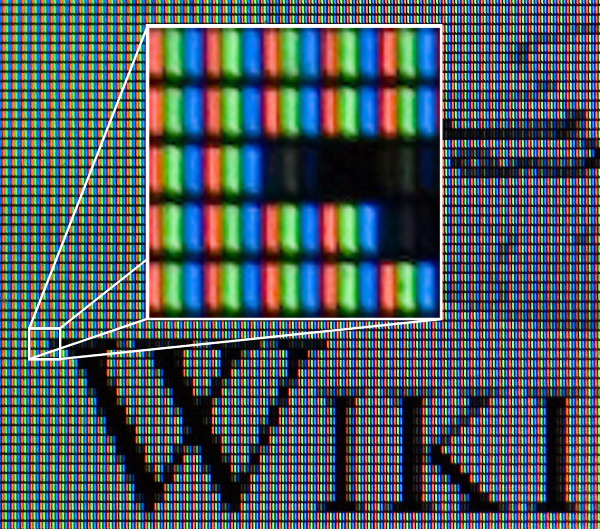
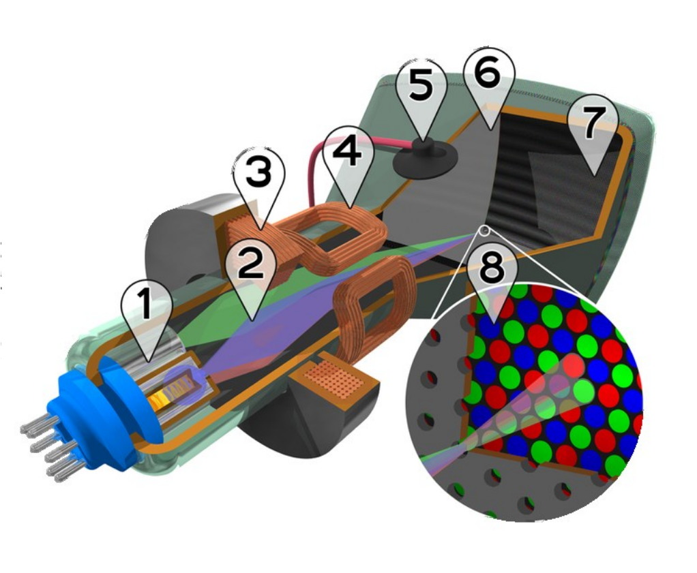
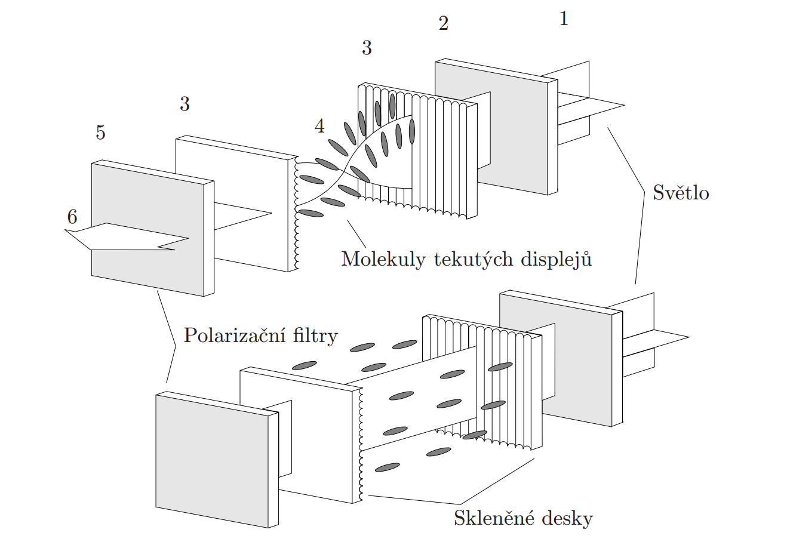
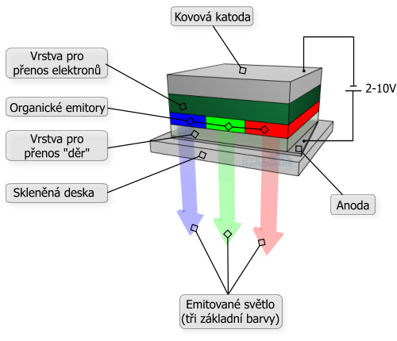
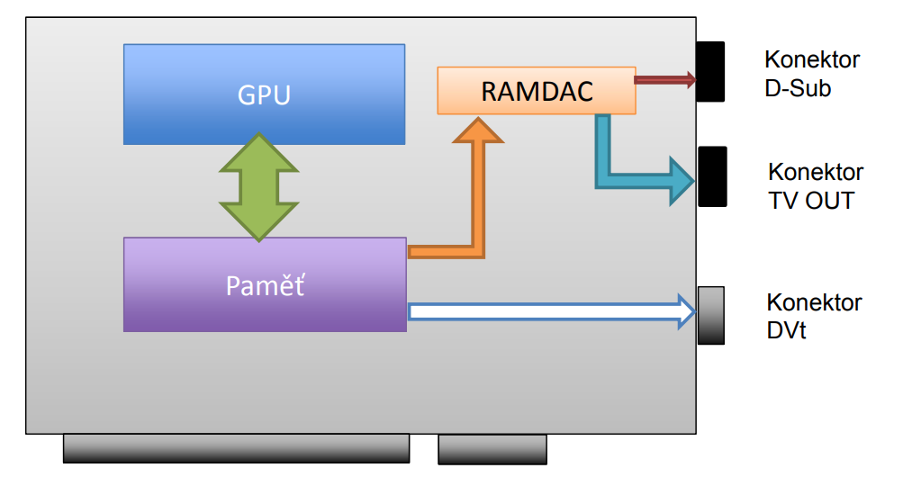

# Otázka č. 1 - Zobrazovací soustava
základní rozdělení
- tvoření obrazu - grafická karta
- zobrazení obrazu - monitor

# Zobrazení obrazu
## Typy zobrazení
- textový
    - historicky byla obrazovka todělena na políčka kde každé pole mohlo být jeden znak
    - časté bylo 80 sloupců a 25 řádků

- grafický
    - obrazovka je vlastně matice bodů, po rozsvícení určitých bodů se vyobrazí text nebo i obrázek. 

## Parametry
- úhlopříčka
- poměr stran
- hmotnost
- porty
- typ obrazovky
    - LCD
    - OLED
- typ roslišení
    - Full HD 1920x1080
    - Quad HD (2K) 2560x1440
    - 4K 3840x2160
    - Ultra Wide 
- odezva
- frekvence
- jas
- počet barev
- kontrast
- spotřeba
- další funkce monitoru
    - polohavtelnost
    - dotykový
    - filtr modrého světla

## Pixel
- nejmenší jednotka digitalní rastrové grafiky
    - jeden bod na monitoru
    - každá pixel má vlastní souřadnice
    - pixel se skládá ze 3 barev RGB
    

## CRT - Cathode-ray tub
### Historie
- 1897 katodová paprsková trubice CRT
- 1926 první CRT obrazovka
- 1928 první barevné CRT

### Princip
    CRT funguje na principu využití elektronového paprsku. Elektronový paprsek vychází z emitoru do vakuového prostředí v monitoru. Tento paprsek prochází elektromagnetickými cívkami, které ho usměrňují na fosforovou vrstvu. Když elektrony dopadnou na fosfor, způsobí její záření. Kontrolou intenzity a místa můžeme vytvářet různé barvy a tvary na obrazovce

### Součástky
1. Elektronové dělo (emitor): Zdroj elektronů
2. Svazky elektronů
3. Zaostřovací cívky
4. Vychylovací cívky
5. Připojení anody: Místo kde je elektronový paprsek urychlen
6. Maska pro oddělení paprsků pro 
    červenou, zelenou a modrou část 
    zobrazovaného obrazu
7. Luminoforová vrstva s červenými, 
    zelenými a modrými oblastmi
8. Detail luminoforové vrstvy, 
    nanesené z vnitřní strany 
    obrazovky

Výhody
- ostrost
- zobrazení věrohodných barev

Nevýhody
- velikost
- spotřeba
- vyzařování a problikávání

## LCD - Liquid-crystal display
### Historie
- 1888 popsání principu tekutých krystalů
- 1973 první LCD monitor

### Princip
    LCD panel se skládá z buněk, které jsou tvořeny elektroluminiscenční výbojkou a dvěma polarizátory. Mezi dvěmi orientačními filtry se nachází vrstva
    tekutých krystalů. V klidovém stavu prochází světlo tekutými krystaly –
    buňka svítí. Zapnutý zdroj střídavého napětí změní vnitřní strukturu tekutého krystalu a světlo je zablokováno na polarizátoru – buňka nesvítí.
    Intenzita světla se mění v závislosti na velikostí napětí připojeného k elektrodám.

1. světelný zdroj - elektroluminiscenční výbojka
2. polarizační filtr
3. orientační filtr
4. vrstva tekutého krystalu
- u barevných displejů RGB filtr 
5. polarizační filtr
6. skleněná destička - finální výstup

vrchní buňka pootočí světlo a tedy propustí, spodní nepropuští.
propuštění světla závisí o kolik se světlo natočí.

### Výhody oproti CRT
- výrazně nižší spotřeba
- menší rozměry
- nevydává škodlivá záření
- obraz nekmitá
- v okrajích obrazovky nedochází k deformaci

Výhody
- kvalita obrazu
- životnost
- spotřeba

Nevýhody
- citlivost na teplotu
- pevné rozlišení
- vadné pixely
- doba odezvy

## OLED - Organic light-emitting diode
- 1987 první OLED displej

Po přivedení napětí jsou vyvolány 
kladné a záporné náboje, 
ty se spojují ve vyzařovací vrstvě a produkují světelné záření

Principiálně jde o matici miniaturních LED v ploše displeje

6 vrstev organických látek
1. Katoda
2. Vrstva vypuzující díry 
3. Vrstva přenášející díry
4. Vyzařovací vrstva
5. Vrstva přenášející elektrony
6. Anoda

výhoda OLED jsou lepší barvy

jenže barevné body stárnou, pro představu
- modré 1 000h
- zelené 10 000h
- červené 30 000h

## Plasmové
- 1936 princip plasmové obrazovky
- 1983 první plasmová obrazovka
vhodné pro velké obrazovky

Výhody
- kvalitní a kontrastní obraz
- bez nutnosti podsvícení
- velké pozorovací úhly
- minimální hloubka a hmotnost

Nevýhody
- paměťový efekt
- levnější plazma displeje mají problémy s kontrastem
- cena
# Vytváření obrazu - Grafická karta

## Základní definice
Grafická karta součástka počítače, která kreslí obraz pro monitor. Je to velmi náročná činnost na výkon a proto je grafická karta prakticky samostatný počítač s vlastním procesorem GPU, a pamětí.
Grafické karty je možno i paralelně propojit pro vyšší výkon
## Součástky grafické karty
- GPU - Graphics processor unit je samostatný mikroprocesor jehož práce je vytvořit obraz
- operační paměť - paměť pro hotový obraz, následně přenesen na obrazovku
- Množství přenesených dat limituje frekvence a šířka sběrnice spojující GPU o OP
- RAMDAC převádí digitální obraz z operační paměti karty na analogový, který vstupuje do monitoru
- Grafická karta generuje spoustu tepla a je nutné efektyvní chlazení
    - pasivní
    - aktivní větráčky
    - vodní
- Kartu se základní deskou spojuje AGP/PCIe

## Parametry
- GPU
- kapacita paměti (nVidia 4090 GDDR6X - 24GB)
- takt paměti a typ
- šířka sběrnice
- porty
- chlazení
- velikost
- podsvícení
## Porty
- DVI
    - přenášení po řádku
    - single link jsou 4 páry kroucené dvojlinky
    - dual link pro vyšší frekvenci/bandwith
    - DVI-D digital
    - DVI-A analog
    - DVI-I digital + analog
- VGA
- HDMI
    - přenost videa ve standartní/HD kvalitě
    - 8-kanálový digitální zvuk
    - HDMI-A - 19 pinů - kompatibilní s DVI-single link
    - HDMI-B - 29 pinů - kompatibilní s DVI-dual link
- Display port
    - 128 šifrování AES
    - rychlost až ~32Gb/s
    - má nahradit starší technologie

## GPU
úkolem GPU je vytvářet jednotlivé pixely obrazu
### pipeline a texel
- dříve používaly grafické čipy pouze jednu cestu pro zpracování instrukcí 
(pipeline) dnešní karty jsou vybaveny několika pipeline (tisíce), které dokážou pracovat paralelně
- jedna pipeline mohla vykreslit jeden pixel v jednom taktu
- vytvářený obraz se rozloží na části nejčastěji čtverce
    - každá pipeline produkuje jeden čtverec obrazu
    - dosaženo paralelního kreslení a zrychlení tvorby obrazu
- na každý vykreslený pixel mohla být aplikována jedna textura za cyklus: fill-rate
- pro prostorový obraz nutno na každý pixel aplikovalo více textur
- elementární textury se nazývají texely
- pixel = několik texelů
### Shadery
- v každé pipeline jsou umístěny Shadery
- shadery pracují s jednotlivými pixely¨
    -  Vertex Shader vytváří trojrozměrné objekty,      umísťuje je do prostoru a stará 
    se o světelné efekty
    - Pixel Shader definuje barvu a průhlednost objektů

### parametry GPU
- frekvence
- počet pipeline
    - počet pipeline => počet shaderů
    - počet texelů vytvořených za 1 takt
- maximální teoretický fill-rate
- maximální teoretický texel fill-rate
- frekvence (nVidia 4090 - AD12 má 2235MHz) 
- software tvorby obrazu např.
    - microsoft DirectX11
    - OpenGL

### výrobci GPU
- nVidia
- AMD
- ATI (AMD)
- Matrox
- Intel