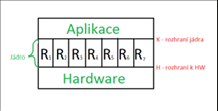
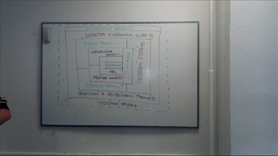

# Otázka č. 9 - Operační systém

- Rutina
    -  funkčně vymezená část kódu, nejčastěji ve formě podprogramu

## Funkční pohled

- OS je sw správce prostředků

### Hardwarové prostředky (fyzické)

- Jsou tvořeny všemi HW komponentami včetně periferií

1. **Centrální** - procesor, operační paměť
2. **Vnější paměti** - disky, cd
3. **IO** - klávesnice, atd

### Softwarové prostředky (logické)

- jsou vytvářeny rutinami OS, za využití jiných prostředků, to jak fyzických tak logických, mezi nejdůležitější patří

1. **Centrální** - proces, paměťový region
2. **Nízko úrovňové** - logický disk, display, znaková zařízení
3. **Dílčí** - soubor, gui, 
4. **Virtuální** - virtuální paměťový nebo síťový disk, tiskárna 
5. **Synchronizační a komunikační** - roura, socket, mutex 
6. **Bezpečností** - účet, šifrovaný komunikační kanál
7. **Síťové** - TCP/IP socket, http/s server 

### Proces

- Je Instancí programu
- Každý program může být vykonán a to v dané instanci OS. Každé toto vykonání od okamžiku provedení první instrukce, po provedení instrukce poslední, označujeme termínem proces

- Každá rutina může být vykonávána pouze v rámci procesu
- V každém okamžiku OS musí existovat alespoň jeden proces
- Procesy vznikají jako reakce na požadavek jiného procesu (rodičovského)

### Paměťový region

- Souvisle adresovatelná oblast paměti, přidělená procesu
- Přímí přístup k této paměti

### OS jako správce

- Hlavní účel správy spočívá ve vytváření přesně definovaného a bezpečného prostředí pro procesy a to ve dvou těsně provázených směrech
- Vytvoření takzvaně virtuálních počítačů
    - Rutiny OS vytvářejí pro programy jednotné rozhraní, které má charakter virtuálního PC
- Nezávislost jednotlivých procesů 
    - Pro každý proces běžící v rámci OS musí rutiny OS vytvářet iluzi, že je jediným procesem, který kdy běžel, běží a bude běžet v rámci dané instance OS (instance OS vzniká bůtováním systému a zaniká vypnutí PC)

## Systémový pohled

- OS je tvořen množinou rutin, které je možno na základě vzájemného volání organizovat do několika vrstev, nejníže leží vrstva rutin, které přímo přistupují k fyzickým prostředkům, dále skupina rutin přímo volajících rutiny nejnižší vrstvy

- Každá vrstva nabízí vyšším vrstvám přesně definované rozhraní (virtuální PC) 

- Jádro OS (kernel)
    - Do jádra patří ty rutiny, které bezprostředně přistupují k HW PC, respektive zajišťují virtualizaci nezbytnou k zajištění nezávislosti jednotlivých procesů

## Architektura OS

- OS jsou dány různými požadavky a rozmanitými přístupy jejich autorů, tj. kolik OS tolik architektur

- Základní klasifikace je dle úrovně spolupráce jednotlivých rutin OS
    - Monolitické - S těsním propojeným rutin
    - Hierarchické - Úroveň spolupráce je omezena hierarchickým principem
    - Klient - Server - Plně distribuované 

### Monolitické OS

- Jsou možné pouze u nejjednodušších OS a vývoj vedl k jejich úplné eliminaci
- Jádro je tvořeno souborem paralelních rutin a je omezeno dvěma ostrými rozhraními
- Rozhraní jádra využívají systémové procesy i běžné aplikace
- Rozhraní jádra je často provázeno změny režimu privilegovanosti procesoru (ochrana), pokud proces vykonává kód aplikace, běží v takzvaném uživatelském nebo neprivilegovaném režimu, ale může přistupovat pouze k části OP a nesmí provést privilegované instrukce
- U režimu jádra či takzvané privilegovanosti režimu vykonává pouze rutiny jádra a má přístup k celé fyzické paměti.
- Proces mění úroveň privilegovanosti pouze při vzniku přerušení (např. stisk klávesy, stisk myši atd.) a při návratu z něho
- Př. Solaris, Dos

### Hierarchické OS

- Dnes neexistuje OS, který by neobsahoval její rysy
- Zde jsou rutiny OS uspořádány do vrstev, které postupně obalují hardware a nabízejí vyšším vrstvám pevně definovaná rozhraní 
- Systém vyžaduje, aby rutiny každé vrstvy přímo volaly, pouze vrstvy bezprostředně nižší (nelze zcela dodržet a setkáváme se i s přímým voláním hlouběji zanořených vrstev)
- Kromě vertikálního členění je zde typické i členění horizontální 
- Nejčastěji se na úrovni jádra vyčleňují tyto subsystémy:
    - Správa procesů
    - Správa paměti 
    - Souborový systém
    - Síťový a komunikační 
    - Vstupně výstupní 
- Hal - hardware abstration layer
- HAL - podobné jako API, uvnitř OS je utvářena mezivrstva , která usnadňuje programovaní ovladačů u jednotlivých zařízení 
- API - rozhraní pro volání systémových služeb, vytvářejí vrstvu s jednoduchými funkcemi které využívají programátoři

### Klient - Server

- Tato architektura přináší plně distribuovaný přístup (pozornost na několik objektů současně, bohužel snižuje výkonost systému)
- Relativně pomalé a tudíž omezeně konkurence schopné 
- Dnešek je lepší 

- Hlavní změnou oproti hierarchickému modelu je vyčlenění všech zbytečných rutin z jádra, do specializovaných systémových procesů - serverů 
- V jádře zůstávají pouze zcela nezbytné rutiny pro virtualizaci paměti, přepínání a komunikaci procesů, resp. Pro přístup dalším HW prostředkům
- Výsledné redukované jádro (mikrojádro) nabízí ostatním procesům, pouze základní funkce, vše ostatní zajišťují servery, prostřednictvím mezi procesorové komunikace (IPC) rychlost a efektivnost komunikace je klíčem této architektury
- Počet serverů je formálně neomezený, mezi ty nejdůležitější patří souborový systém (SS), bezpečnostní a API
- API jsou nejdůležitější z hlediska programátora, volání služeb OS 

