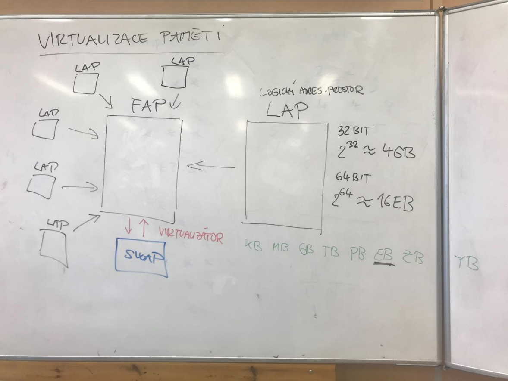
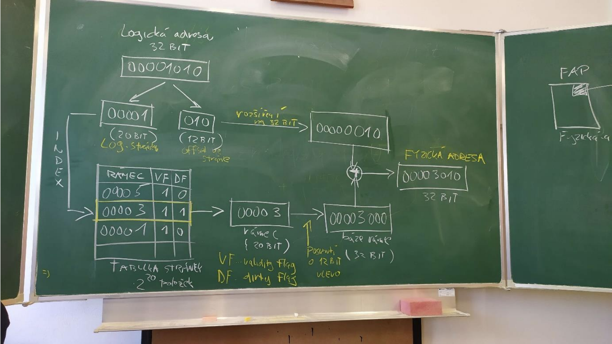
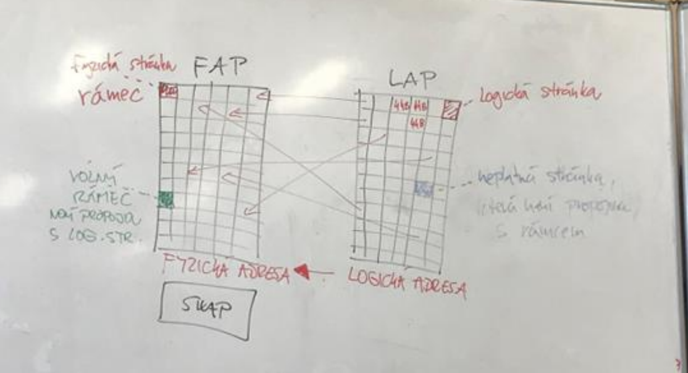

# Otázka č. 11 - Virtualizace paměti

- Předchozí triviální metody správy OP nebyly příliš optimální. Řešením na vyšší 
úrovni je úplná virtualizace paměti. Vzniká nám souvislý adresový prostor, který 
není fyzicky reprezentován souvislým blokem OP. Velikost tohoto tzv. 
virtuálního či lépe logického adresového prostoru (**LAP**) není omezena velikostí 
skutečné OP, ale pouze velikostí adresy (32bit cca 4 GB, 64bit cca 16 EB). 

LAP lze rodělit na tři části

- 1) Adresy, které nebyly použity (Nebylo z nich čteno ani do nich zapisováno). Toto část nemá žádnou fyzickou reprezentaci a tvoří většinu LAP.

- 2) Tato část obsahuje adresy, na kterých jsou uložená data a musí mít fyzickou reprezentaci.
    - Tuto část lze rozdělit podle místa uložení dat.
        1) OP (RAM) - Primární paměť. Menší kapacita, ale vyšší rychlost.
        2) Vnější pam. zařízení (HDD, SSD) - Výrazně vyšší kapacita, ale pomalejší.

- O tohle se nám stará **virtualizátor**, je to součást správy OP, která ukládá právě využívaná data to OP a data delší dobu nepoužívaná na disk.
- Hlavní podstata je převedení požadavků z LAP na skutečné paměťové zařízení.

- Virtualizace **NENÍ** jediným správcem paměti a musí být doplňena klasickou správou OP. Ta ovšem už nespravuje FAP, ale LAP.

- Pro správu LAP lze použít dřívější metodu strategie, díky charakteru logické 
paměti se většina nevýhod minimalizuje či dokonce eliminuje.

- Příklad: Při použití strategie dynamických bloků pro logickou paměť může 
stále docházet k fragmentaci, která se však při vhodně zvolené metodě 
virtualizace (stránkování) neprojevuje na fyzické paměti. Fragmentace 
LAP je sice nepříjemná, avšak není nebezpečná (rozsah LAP je řádově 
větší, a navíc je užíván jen jedním procesem).

# Stránkování

- HW mechanismus umožňující plnou virtualizaci paměti (prováděno procesorem)
- MMU (Memory Managment Unit)

- Dvě základní části 
    1) Překlad adres (Logická na fyzickou)
    2) Výpadek stránky (přerušení při přístupu k neplatné stránce)

- Překlad adres rozděluje LPA na logické stránky stejné velikosti.
- Rozděluje i FAP, ale na rámce
(LAP = stránky, FAP = rámec)
- mezi LAP a FAP existuje neuplné zobrazení - vždy budou existovat stránky bez přiřazeného rámce - neplatné stránky.
- Můžou existovat i rámce, které nemají stránku - volné rámce

- Každou logickou adresu lze rozdělit na dvě části
    1) První s vyššími bity - označuje logickou stránku
    2) Druhá nižší obsahuje adresu paměťového místa vztaženého k dané stránce (Stránkový ofset)

- Překlad adres (tohle do lidštiny asi nepřepíšu)

Přímým procesem překladu projde pouze číslo logické stránky. Překlad se děje 
převodem čísla (pořadí) logické stránky na číslo rámce prostřednictvím 
takzvané tabulky stránek. Tabulka obsahuje položky, které jsou indexovány 
číslem logické stránky a obsahují číslo rámce a skupinu příznaků (VF tzv. validity 
flag, příznak platnosti, DF tzv. dirty flag, příznak zápisu do stránky). Získané 
číslo rámce fyzické stránky je bitovým posunutím vlevo (zprava jsou k číslu 
připojeny binární nuly) převedeno na bázovou adresu rámce ve fyzické paměti. 
Posledním krokem je přičtení stránkového offsetu k bázové adrese rámce, čímž 
se již získá fyzická adresa.

## Výpadek stránky

- Situace, kdy proces přistoupí k neplatné stránce

- Výpadek je přerušením (výjimkou), které přeruší instrukci a předá řízení obslužné rutině jádra.
- Tato rutina má dvě možnosti, jak se zachovat.
    1) Nalezne odpovídající rámec a zajistí jeho propojení se stránkou, kterou následně splatní (V tabulce se uloží index rámce a nastaví se bit platnosti)
    2) Ukončí proces a pošle výjimku

- O tom, jak se zachová, rozhoduje umístění stránky v LAP.

- Poslední fází výpadku je opětovné provedení přerušené instrukce.
- Na druhý pokus již výpadek nezpůsobí, protože stránka je už platná-
- O restartování instrukce se stará MMU, který tvoří relativně významnou část procesoru.