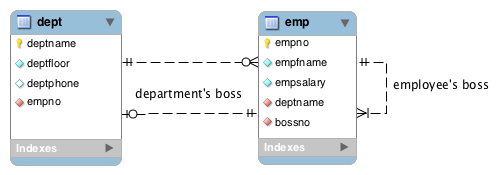
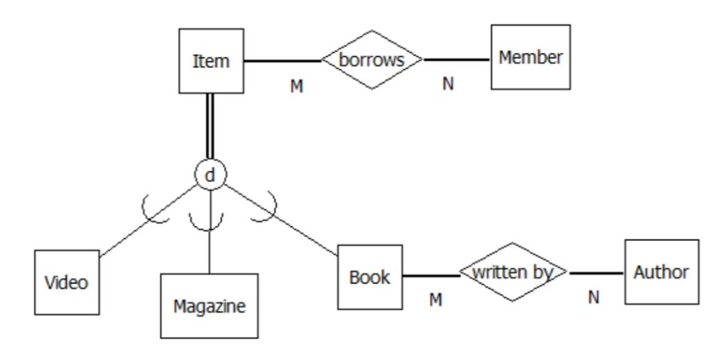

# Otázka č. 17 - Specifické ERD, logický a fyzický model DB

## Rekurzivní model DB

- databázovém návrhu se vyskytuje, když entita v databázi má vztah sama na sebe. Tento koncept se často používá pro hierarchické struktury nebo stromové struktury dat.
- Využívá self join a volá sama sebe
- V ERD (Entity-Relationship Diagram) se rekurzivní vztah zobrazuje jako asociace mezi entitami stejného typu.

### Příkady 
- Máme tabulku "Zaměstnanec" s atributy "ID_zaměstnance", "Jméno", "Příjmení" a "Nadřízený_ID". V tomto případě "Nadřízený_ID" ukazuje na ID zaměstnance, který je nadřízeným. Zaměstnanec může mít jiného zaměstnance jako nadřízeného, což způsobuje rekurzivní vztah.

- Na internetové diskuzi máme komentáře. Na tyto komentáře může být napsán další komentář a na něj poté další komentář,  takto může rekurzivní vztah pokračovat až k poslednímu komentáři.

## Supertypy a subtypy, oblouk (arc)

- Supertyp je obecný typ entity, zatímco subtypy jsou specifické instance tohoto typu.

- **Supertyp** Reprezentuje obecnou kategorii nebo typ entity, který sdílí nějaké společné vlastnosti. Například, "Zvíře" může být supertypem pro různé druhy zvířat.
- **Subtypy** Jsou specifickými instancemi supertypu, které mají unikátní vlastnosti nebo charakteristiky. Například, "Kočka" a "Pes" mohou být subtypy "Zvíře".

- Oblouky jsou grafickými prvky v ERD (Entity-Relationship Diagram), které reprezentují vztahy mezi entitami...

- V ERD jsou supertypy a subtypy obvykle znázorněny jako oddělené entity, kde je supertyp spojen obloukem se svými subtypy. Tato vizualizace umožňuje snadnou identifikaci hierarchie dat a vztahů mezi různými typy entit.

### Příklady

- "Vozidlo" je supertyp, který reprezentuje obecnou kategorii vozidel. Subtypy, "Auto" a "Motocykl", jsou specifické instance "Vozidla".

- V realitní kanceláři může být supertyp "Nemovitost" s atributy jako "ID_nemovitosti", "Adresa", "Cena". Subtypy mohou zahrnovat "Byt", "Dům", "Pozemek", každý s vlastními atributy. - V ERD by supertyp "Nemovitost" měl oblouk směřující k subtypům "Byt", "Dům" a "Pozemek", což ukazuje jejich vztah.

## Logický model DB (normalizace, NF)

- Logický model DB popisuje strukturu databáze založenou na relačním modelu a zahrnuje normalizaci dat, což je proces organizace dat tak, aby minimalizoval redundanci a anomálie.

- Normalizace dat zajišťuje, že databáze je v normálové formě (NF). Existuje několik stupňů normalizace, jako je 1NF, 2NF, 3NF a 0NF.

- 1. Nulová normálová forma (0NF)
    - V této formě jsou data uložena bez jakýchkoliv pravidel normalizace. 
    - Jedna buňka tabulky může obsahovat více hodnot nebo skupiny hodnot. 
    - Příkladem může být tabulka s opakujícími se skupinami atributů, jako je například tabulka, která ukládá informace o uživatelích a jejich zálibách v jediném sloupci.
- 2. První normálová forma (1NF)
    - V této formě jsou data atomická, což znamená, že každý atribut obsahuje pouze jednu hodnotu a není dělen na podatributy.
    - Příkladem porušení 1NF může být tabulka, kde jeden sloupec obsahuje více hodnot oddělených čárkami, například sloupec "Telefonní čísla" obsahující "123456789,987654321".
- 3. Druhá normálová forma (2NF)
    - V této formě jsou odstraněny částečné závislosti na klíči. 
    - To znamená, že každý neklíčový atribut v tabulce závisí pouze na celém klíči. 
    - Příkladem porušení 2NF může být tabulka, kde klíčem je kombinace "ID uživatele" a "Název kurzu", ale "Počet kreditů" je závislý pouze na "Název kurzu".
- 4. Třetí normálová forma (3NF)
    - V této formě jsou odstraněny  závislosti mezi atributy.
    - Každý neklíčový atribut je závislý pouze na primárním klíči, nikoli na jiných neklíčových atributech.
    - Příkladem porušení 3NF může být tabulka, kde "Adresa" uživatele určuje "Město", které pak určuje "PSČ".
    - Adresa by měla být v samostatné tabulce a město s PSČ by měly být v jiné tabulce.

- Pokud tabulka splňuje určitou normálovou formu, musí také splňovat všechny předešlé normálové formy.

## Fyzický model DB

- Fyzický model DB je implementace logického modelu v konkrétním databázovém systému.
- K realizaci fyzického modelu je třeba znalost SQL a použití dotazovacích příkazů, definicí tabulek, indexů a dalších objektů.
- Jedná se o praktické provedení Konceptuálního návrhu ERD.
- Tvůrce si vybere způsob tvoření a jazyk databáze dle požadavků jeho aplikace.
- Model tvoříme pomocí příkazů, které spadají do následujících kategorií.

### SQL

- standardizovaný jazyk používaný pro manipulaci s daty v relačních databázích. 
- Tento jazyk umožňuje vytváření, aktualizaci, dotazování a správu dat v databázích. 

#### DDL (Data Definition Language)

- Používá se k definici datových struktur v databázi. Příklady zahrnují příkazy jako **CREATE** pro vytváření tabulek a **ALTER** pro změnu struktury a **DROP**  pro odstranění tabulek.

#### DML (Data Manipulation Language)

- Slouží k manipulaci s daty v databázi. Příklady zahrnují příkazy jako **INSERT** pro vkládání dat, **UPDATE** pro aktualizaci a **DELETE** pro odstranění.

#### DQL (Data Query Language)

- Používá se k dotazování dat v databázi. Příkladem je příkaz **SELECT** pro získání dat z tabulek.

#### DCL (Data Control Language)

- Kontroluje přístup k datům v databázi. Příklady zahrnují příkazy **GRANT** pro poskytnutí přístupových práv a -**REVOKE** pro jejich odebrání.

#### TCL (Transaction Control Language)

- Používá se k řízení transakcí v databázi. Příklady zahrnují **COMMIT** pro potvrzení změn a **ROLLBACK** pro vrácení databáze do předchozího stavu. **SAVEPOINT** pro vrácení se k určitému bodu v transakci a **START TRANSACTION** pro zahájení nové transakce.