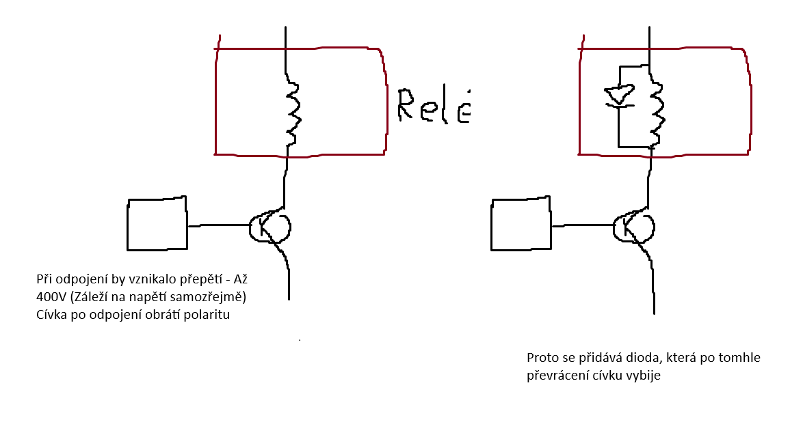
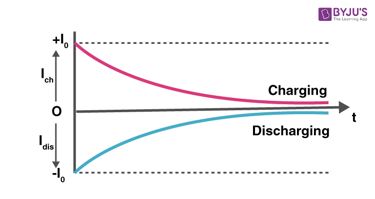
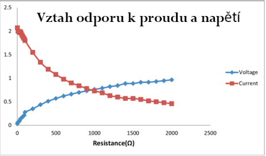

# Otázka č. 26 - Funkce a zpojení základních elektronických součástek

# Cívky

- Namotaný drát, který vytváří elektromagnetické pole.
- Používá se v elektromagnetech, relé nebo transformátorech.
- Jednotka Henry (H)

- Zároveň bzrdí špičky v nápětí

- **Habroš říká:** "Cívky v obvodu jsou průser."

# Kondenzátory

- Vzniká umístěním dvou vodivých desek vedle sebe.
- Mezi nimi se nachází izolant

- slouží k uložení energie vyhlazení špiček v obvodu

## Keramické kondenzátory

- Jako inzolant používají tenkou vrstvu keramiky
- Mají obvykle malou kapacitu (Pikofarady)

## Elektrolytické kondenzátory

- Jako izolant používají elektrolyt.
- Mají značně větší kapacitu dokonce i ve Faradech.

# Resistory

- Součastka zamezující průchod proudu
- U = R * I

- Resistor, malý výkon

- Výkonový resistor, Pobere více energie než shoří

# Polovodiče

- Součastky, které vedou jen za určitých podmínek
- **Vlastní polovodiče** - Skladají se pouze z čistého prvku (Křemík, Germanium, Dneska převažuje křemík) 99,999% čistota

- **Nevlastní (Přměsové) polovodiče** - Do velkého množství čistého prvku se přimíchá množství jiného prvku (Bor, Fosfor, Galium).
Příměsy je jen malé množství - 0,00001% příměsy.

- **Hábík to přirovnává:** ke kostce 10x10x10m materiálu, do které se přimíchá špička čajové lžičky jiného prvky.

P a N přechod

- Základem polovodičů je tzv. PN přechod
- Funguje jako jednostraná průchodka (Dioda)
- Strana P má volný elektron, kdežto strana N má volnou díru. 

## Dioda

- Slouží jako "Jednosměrka" v elektronice.
- Pustí proud jedním směrem, ale už ne druhým.

- ochrana obvodů a usměrňování střídavého proudu

## Tranzistor

- Slouží jako spínač.
- Aplikováním napětí na bázi začne tranzistorem procházet proud. 

- PNP - sepnuto signálem LOW (nula)
- NPN - sepnuto signálem HIGH (jednička)